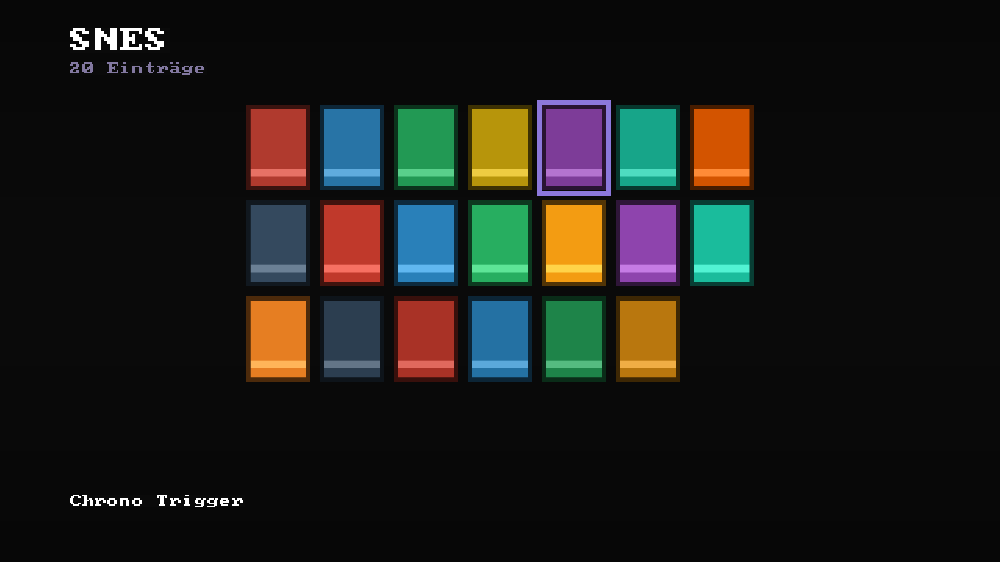
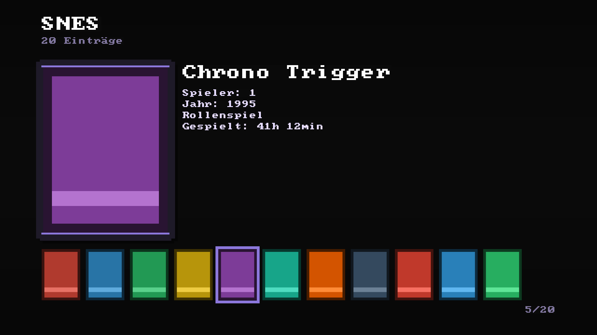

# Dragend — MiSTer Custom Frontend v4.5

**Von Dragrem2K**, mit Beiträgen von **TheRealSuTefan**, **Dfense** und
**Dennsen**.

🇬🇧 [English](README_EN.md) · 📖 [Handbuch](docs/HANDBUCH.md) ·
📄 [Anleitung als PDF](docs/Dragend_Anleitung.pdf) ·
📝 [Changelog](CHANGELOG.md)

Ein Spiele-Browser für den MiSTer FPGA: Boxart, Spielinfos, Gamepad- und
Tastatursteuerung, Hintergrundmusik, CRT und HDMI gleichwertig. Reines
Standard-Python, keine einzige zusätzliche Abhängigkeit auf dem MiSTer.

  
  &nbsp;&nbsp;
  

  
  &nbsp;
  
  &nbsp;
  

Liste, Raster, Galerie — und der Trophäenraum. Alle Bilder direkt aus dem Programmcode gerendert (<code>tools/screenshots_bauen.py</code>), Boxart und Spielstände sind Platzhalter.

---

## Installieren: eine Datei, ein Klick

1. [`Frontend_Install.sh`](https://raw.githubusercontent.com/dragrem2k-coder/mister-frontend/main/Scripts/Frontend_Install.sh)
   herunterladen (Rechtsklick → *Speichern unter*).
2. Nach `/media/fat/Scripts/` kopieren — per WinSCP oder mit der SD-Karte
   am PC.
3. Auf dem MiSTer: **Scripts → „Frontend Install"** ausführen.

Das Skript lädt alles Weitere selbst, richtet den Autostart ein und
startet das Frontend am Ende von allein. Kein SSH, kein Entpacken.

**Update:** dasselbe Skript noch einmal ausführen. Boxart, Musik und
Einstellungen bleiben unangetastet.

**Deinstallieren:** `Frontend_Uninstall.sh` — der MiSTer ist danach exakt
wie vorher. Es wird nichts am System verändert, kein Kernel, kein Image.

Ohne Internet am MiSTer, per SSH, oder von Hand: siehe
[Installation & Update (PDF)](docs/Installation_und_Update.pdf).

---

## Funktionen

### Sammlung

| | |
|---|---|
| **Drei Ansichten** | Liste, Raster, Galerie — für Spieleliste *und* Hauptseite, je Kategorie umschaltbar (F10 / Select+Y) |
| **Boxart & Spielinfos** | Eigene Sammlung unter `art/`, dazu die Datenbank unter `/media/fat/docs`, falls vorhanden. Download-Skript liegt bei |
| **Spielbeschreibungen** | Deutscher Text neben dem Cover in der Galerie |
| **Filter** | Nach Genre, Jahr, Spielerzahl und Entwickler (Tab / Select+L2+R2), je Kategorie merkbar |
| **Suche** | Tippen filtert die Liste sofort |
| **Favoriten & Sammlungen** | Eigene Listen quer über alle Systeme |
| **Zuletzt gespielt** | Eigene Kategorie, sortiert nach letztem Start |
| **ZIP-Archive** | ROMs in Archiven werden gefunden und gestartet, ohne je etwas zu entpacken |
| **Ordner mit einem Spiel** | Werden aufgelöst — wichtig bei PSX, Mega CD und Saturn, wo jedes Spiel in einem eigenen Ordner liegt |
| **ROMs auf NAS/USB** | Netzlaufwerke und USB-Nummern über 5 werden dynamisch gefunden |

### Persönliches

| | |
|---|---|
| **Trophäenraum** | Profil-Bildschirm: meistgespieltes Spiel, Lieblingssystem, Erfolgs-Zähler |
| **Jahresrückblick** | Statistik für das laufende Kalenderjahr |
| **Spielzeit-Tracker** | Wie lange, wie oft, wann zuletzt — pro Spiel und pro System |
| **Top-10-Listen** | Nach Spielzeit, Startzahl, Systemen |
| **RetroAchievements** | Fortschritt, Erfolgs-Vitrine (F6), Popup bei neuen Erfolgen |
| **Durchgespielt & eigene Erfolge** | Auch für Spiele ohne RA-Unterstützung |
| **Easter Eggs & Frontend-Level** | Versteckte Erfolge, Jubiläums-Hinweise, saisonale Dekorationen |
| **Zufalls-Zock / Wonne oder Tonne** | Zufälliges, noch nicht gespieltes bzw. noch nicht bewertetes Spiel |

### Anzeige & Ton

| | |
|---|---|
| **CRT (15 kHz) und HDMI** | Beide mit eigener Optik und eigenem Layout, nicht als Nebeneffekt |
| **Themes** | Farbschemata, Akzentfarbe, einstellbarer Bildrand |
| **Attract-Modus** | Bildschirmschoner mit Cover-Schau, Verzögerung 30 s bis 15 min |
| **Boot-Animation** | Eigenes Startvideo oder die eingebaute D-Pad-Animation |
| **Musik** | Eigene MP3s oder Rainwave-Internetradio (fünf Sender), gemeinsamer Lautstärkeregler |
| **Navigations-Sounds** | Selbst erzeugte Klänge, abschaltbar |
| **CRT-Testbild** | Zum Einstellen von Geometrie und Schärfe |

### Technik & Bedienung

| | |
|---|---|
| **Sprache** | Deutsch / Englisch, jederzeit umschaltbar |
| **Eigene Tastenbelegung** | Tastatur und Joypad frei belegbar |
| **Autostart** | An/aus, jederzeit im Menü |
| **Stream-Overlay für OBS** | Zeigt Spiel, Cover und Musiktitel im Browser |
| **Miniaturen vorbereiten** | Cover einmalig vorberechnen, damit nichts mehr nachlädt |
| **PC-Werkzeug** | Dieselbe Arbeit am Windows-PC statt auf dem MiSTer — aus Stunden werden Minuten (`pc_tools/`) |
| **C-Modul** | `libdragend.so` rechnet die Bildskalierung 100-fach schneller. Optional; fehlt sie, rechnet Python weiter |

Alles ausführlich: **[Handbuch](docs/HANDBUCH.md)**.

---

## Bedienung, kurz

| Taste | Pad | |
|---|---|---|
| Pfeiltasten | D-Pad | Navigieren |
| Enter | A / Start | Auswählen, Ordner betreten |
| Esc | B / Select | Zurück |
| F2 oder `/` | Select + A | Suche |
| Tab | Select + L2/R2 | Filter |
| F6 | Select + X | Erfolgs-Vitrine |
| F7 / F8 | L2 / R2 | Durchgespielt / Favorit |
| F10 | Select + Y | Ansicht umschalten |
| F11 | — | Zufälliges Spiel starten |
| F12 | Guide / Mode | MiSTer-OSD öffnen |
| **F1** *(im Spiel)* | — | Zurück ins Frontend. Esc tut dasselbe, muss aber ~0,6 s gehalten werden |

**F9 ist absichtlich frei.** MiSTer benutzt sie selbst für den Wechsel
zwischen Konsole und Grafikmodus — das Frontend spielt sie sogar selbst
ein. Der Belegungs-Assistent lehnt sie deshalb ab.

Die vollständige Belegung steht in der
[Anleitung als PDF](docs/Dragend_Anleitung.pdf).

---

## Voraussetzungen

- MiSTer FPGA mit aktuellem Main und Linux-Image
- Freier Platz auf der SD-Karte: rund 20 MB für das Frontend, dazu die
  Boxart
- Für Downloads und Radio: Netzwerk. Alles andere läuft offline

Nicht nötig: SSH, ein zusätzliches Paket, eine Systemänderung.

---

## Warum ein eigenes Frontend?

Die übliche Sorge bei einem Frontend auf dem MiSTer ist die Leistung —
es gibt keine GPU, und die ARM-CPU ist ohnehin beschäftigt. Genau darin
lag der Schwerpunkt: der größere Teil der Arbeit floss nicht in
Funktionen, sondern in Messen und Nachbessern. Man soll das Menü im
Alltag nicht spüren.

Es gibt Alternativen, und sie sind gut: **Zaparoo Frontend** (größer,
von mehreren getragen, mit NFC-Tags) und **Taki Udons Console Mode**
(komplett per Controller, sehr zugänglich). Was hier anders ist:

- **Keine Systemänderung.** Ein Python-Programm auf einem unveränderten
  MiSTer. Eine Deinstallation lässt nichts zurück.
- **Keine Abhängigkeiten.** Nur die Python-Standardbibliothek.
- **CRT gleichwertig zu HDMI**, nicht als Nebeneffekt.
- **Die Sammlung soll sich lebendig anfühlen**, nicht nur schnell
  bedienbar sein — Trophäenraum, Jahresrückblick und Spieltagebuch sind
  der eigentliche Kern, kein Beiwerk.

Ehrlich gesagt: ein Hobbyprojekt, kein Team-Produkt. Weniger getestete
Aufbauten als bei einem großen Community-Projekt, dafür sehr genau auf
die eigene, täglich genutzte Hardware abgestimmt.

---

## Wo was liegt

| | |
|---|---|
| `frontend/` | Das Programm. `frontend.py` plus das Paket `fe/` |
| `frontend/c/` | Das optionale C-Modul samt Bauanleitung |
| `Scripts/` | Installer, Deinstaller, Boxart-Download |
| `pc_tools/` | Das Windows-Werkzeug für die Miniaturen |
| `tools/` | Tests und Diagnosewerkzeuge |
| `docs/` | Handbuch, PDFs, Changelog-Archiv |

---

## Hilfe

Läuft etwas nicht, steht die Fehlersuche im
[Handbuch](docs/HANDBUCH.md#13-fehlerbehebung). Das Frontend schreibt
mit nach `/tmp/frontend.log` — diese Datei ist bei einer Meldung das
Nützlichste, was man mitschicken kann.

Lizenz: [MIT](LICENSE).
