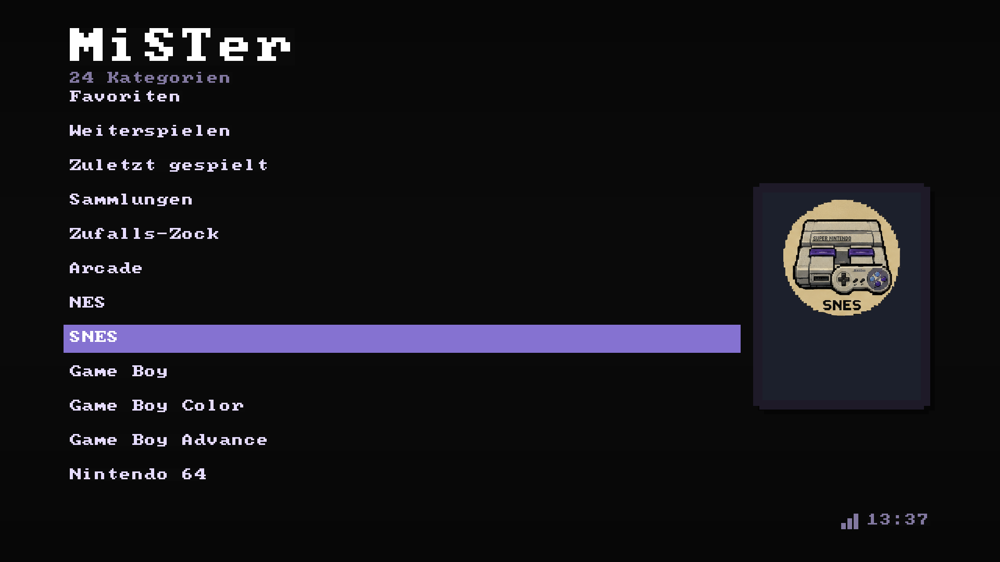
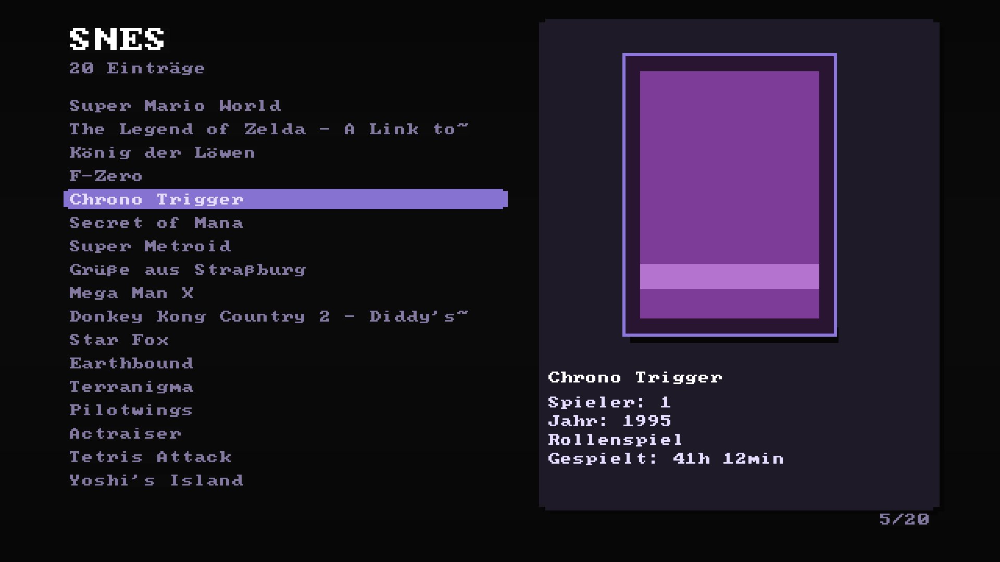
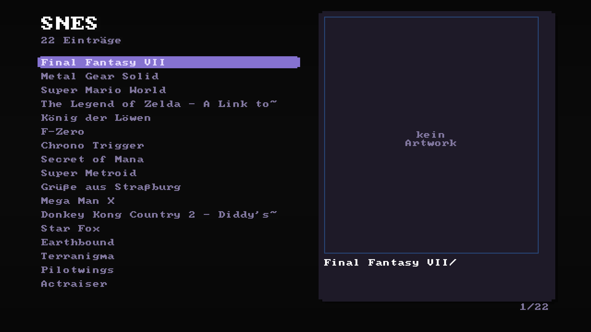
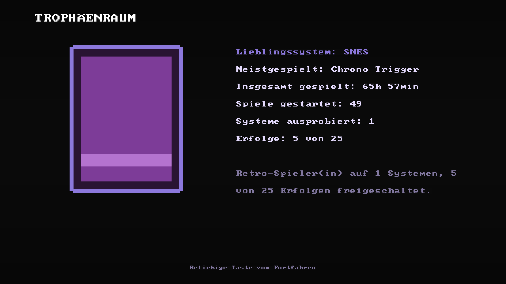
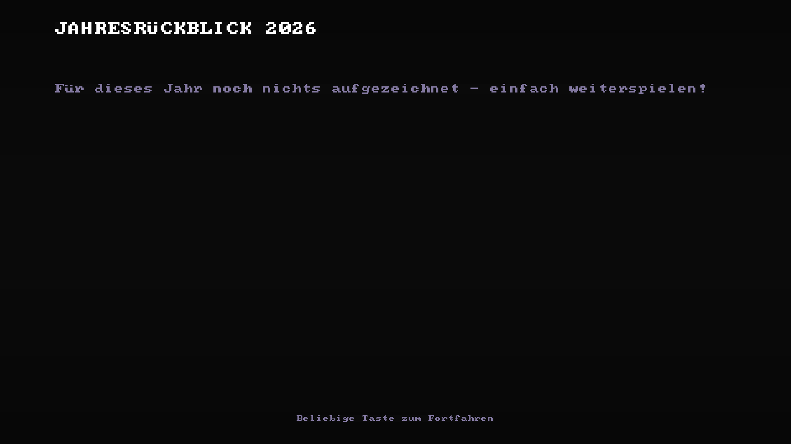

# MiSTer Custom Frontend v4.4
**Von Dragrem2K**, mit Beiträgen von **TheRealSuTefan**, **Dfense**
und **Dennsen**.

Mein selbstgebautes Frontend für den MiSTer FPGA: Spiele-Browser mit
Boxart und Spielinfos, Gamepad- und Tastatursteuerung, Hintergrundmusik,
Deutsch/Englisch umschaltbar, eigene Tastenbelegung, CRT- und
HDMI-Unterstützung, Autostart - alles in reinem Standard-Python, keine
einzige externe Abhängigkeit auf dem MiSTer selbst nötig.

**Zu den Screenshots unten:** direkt aus dem echten Programmcode
gerendert, keine Fotomontage - Boxart und Musiktitel sind Platzhalter,
die Systemlogos links sind echt. Kompakter Überblick zusätzlich in
`VORSCHAU.md`.

<p align="center">
  
  &nbsp;&nbsp;
  
</p>
<p align="center">
  
</p>
<p align="center"><sub>Links: Hauptmenue mit Uhrzeit, Netzwerksymbol, Akzentfarbe und pulsierender Markierung &nbsp;|&nbsp; Mitte: Spieleliste mit Boxart, Glow-Effekt und Schlagschatten &nbsp;|&nbsp; Rechts: Ordner-Navigation - Boxart erscheint auch auf Ordner-Ebene bei Mehrfach-CD-Spielen</sub></p>

**Nicht nur eine Spieleliste** - der eigentliche Kern der Idee sind
Bildschirme wie diese, die die eigene Sammlung persönlich machen statt
nur durchsuchbar:

<p align="center">
  
  &nbsp;&nbsp;
  
</p>
<p align="center"><sub>Links: Trophäenraum - Cover des meistgespielten Spiels, Lieblingssystem, Erfolgs-Zähler &nbsp;|&nbsp; Rechts: Jahresrückblick - eingegrenzt auf das laufende Kalenderjahr, nicht "seit Aufzeichnungsbeginn"</sub></p>

## Warum ein eigenes Frontend?

In der MiSTer-Community wird immer wieder diskutiert, ob ein
grafisches Frontend überhaupt Sinn macht - die Sorge ist meistens
Performance: MiSTer hat keine GPU, und ein schwergewichtiges Menü auf
der Linux-Seite könnte die ohnehin ausgelastete ARM-CPU zusätzlich
belasten. Berechtigte Sorge, und genau da lag mein Schwerpunkt beim
Bauen: der größte Teil der Zeit floss nicht in neue Features, sondern
in gezielte Performance-Arbeit (unter anderem ein Boxart-Schlagschatten,
der allein 60% der Zeichenzeit auf HDMI gefressen hat - gefunden und
auf einen Bruchteil reduziert). Ziel war, dass man das Menü im Alltag
nicht spürt, wenn man's gerade nicht aktiv benutzt.

Mit **Zaparoo Frontend** gibt's inzwischen auch ein aktiv entwickeltes
Community-Projekt mit ähnlicher Zielsetzung für MiSTer (Bibliothek
durchsuchen, Boxart, Zuletzt gespielt, dazu NFC-Tags) - wer eine
größere, von mehreren Leuten getragene Lösung sucht, oder wer NFC-
Karten zum Spiele-Starten will, sollte sich das anschauen. Genauso
gibt's mit **Taki Udons Console Mode** inzwischen eine sehr
zugängliche, komplett per Controller bedienbare Lösung (an die
SuperStation One gekoppelt, funktioniert aber auf jedem MiSTer).

Was hier anders ist:
- **Keine Systemänderung, jederzeit rückgängig** - das hier ist ein
  einzelnes Python-Skript, das auf einem völlig unveränderten MiSTer
  läuft. Kein Austausch von Kernel/Linux-Image, keine zusätzliche
  Hardware nötig. Ausprobieren ohne Risiko: ein Befehl deinstalliert
  wieder rückstandslos (siehe `Frontend_Uninstall.sh`), dein MiSTer ist danach
  exakt wie vorher.
- **Keine externe Abhängigkeit** - reines Python aus der
  Standardbibliothek, läuft ohne ein einziges zusätzliches Paket.
- **CRT und HDMI gleichwertig** - beide mit eigens abgestimmter Optik
  und Geschwindigkeit, nicht nur "HDMI mit CRT-Kompatibilität als
  Nebeneffekt".
- **Klein und nachvollziehbar** - eine einzelne Python-Datei fürs
  eigentliche Frontend, keine Abstraktionsschichten, gut lesbar für
  alle, die selbst was anpassen wollen.
- **Die eigene Sammlung soll sich lebendig anfühlen, nicht nur schnell
  bedienbar** - Trophäenraum, Jahresrückblick, Spieltagebuch,
  Sammlungen und ein kleines Easter-Egg-System sind hier kein
  Beiwerk, sondern der eigentliche Kern der Idee.

Ehrlich gesagt: das hier ist ein Hobbyprojekt, kein Team-Produkt.
Weniger durchgetestete Setups als bei einem großen Community-Projekt,
dafür sehr genau auf die eigene, täglich genutzte Hardware abgestimmt
- inklusive einer ziemlich ausführlichen Entwicklungshistorie zum
Nachlesen (`CHANGELOG.md`).

## Inhaltsverzeichnis

1. Paketinhalt
2. Voraussetzungen
3. Installation Schritt für Schritt
4. Bedienung
5. Hintergrundmusik einrichten
6. Boxart und Spielinfos laden
   - 6b. Automatische Listen-Bereinigung + kuratierte Liste
7. System-Hintergrundbilder (optional)
   - 7b. System-Artbox im Kategorien-Menü
8. CRT-Bildschirme (15 kHz) einrichten
   - 8b. Optische Verfeinerungen
   - 8c. Zuletzt gespielt, Lade-Fortschritt
   - 8d. Attract-Modus / Bildschirmschoner
   - 8e. Favoriten
   - 8f. Uhrzeit-Synchronisierung
   - 8f-2. ROMs auf einem NAS/Netzlaufwerk
   - 8g. Themes/Farbschemata
   - 8h. Navigations-Soundeffekte
   - 8i. Spielzeit-Tracker
   - 8j. Top-10-Listen
   - 8k. RetroAchievements-Fortschritt
   - 8l. Standard- oder RA-Core wählen
   - 8m. Durchgespielt-Status + eigene Erfolge
   - 8n. Easter-Egg-System (Geheimnisse) + Frontend-Level
   - 8o. CRT-Testbild
   - 8p. Mitwirkende
   - 8q. Autostart an/aus
9. Sprache umschalten
10. Eigene Tastenbelegung
11. Boot-Animation (Startvideo)
12. Stream-Overlay für OBS (optional)
13. Fehlerbehebung
14. Bekannte Grenzen

---

## 1. Paketinhalt

| Datei                          | Zielort auf dem MiSTer          | Zweck |
|----------------------------------|----------------------------------|-------|
| frontend/frontend.py            | /media/fat/frontend/             | Das Frontend selbst (v4.4) |
| frontend/frontend_boot.sh       | /media/fat/frontend/             | Autostart-Wrapper (bei jedem Boot) |
| frontend/mister_boxart.py       | /media/fat/frontend/             | Boxart-Downloader (läuft auf dem MiSTer) |
| frontend/mister_gameinfo.py     | /media/fat/frontend/             | Spielinfo-Downloader (läuft auf dem MiSTer) |
| frontend/stream_server.py       | /media/fat/frontend/             | Web-Server fürs Stream-Overlay (optional) |
| frontend/stream_overlay.html    | /media/fat/frontend/             | OBS-Browser-Quelle (optional) |
| frontend/stream_admin.html      | /media/fat/frontend/             | Stream-Overlay-Konfiguration (optional) |
| Scripts/Frontend_Install_Remote.sh | /media/fat/Scripts/           | Installation mit Internetzugang (lädt von GitHub) |
| Scripts/Frontend_Install_Offline.sh | /media/fat/Scripts/          | Installation ohne Internetzugang (aus diesem Paket) |
| Scripts/Frontend_Uninstall.sh   | /media/fat/Scripts/              | Alles wieder sauber entfernen, eigene Daten optional behalten |
| Scripts/Frontend_Install.sh     | /media/fat/Scripts/              | Installation/Update direkt aus dem MiSTer-Menü (Option A) |
| Scripts/Frontend_Start.sh       | /media/fat/Scripts/              | Frontend manuell aus dem MiSTer-OSD starten |
| Scripts/Frontend_Update.sh      | /media/fat/Scripts/              | Nach einem Datei-Update sauber neu starten (1 statt mehrerer Befehle) |
| Scripts/Frontend_Boxart_Download.sh | /media/fat/Scripts/          | Boxart-Download aus OSD/Frontend starten |
| Scripts/Frontend_Gameinfo_Download.sh | /media/fat/Scripts/        | Spielinfo-Download aus OSD/Frontend starten |
| Scripts/Frontend_Stream_Toggle.sh | /media/fat/Scripts/            | Stream-Overlay an/aus schalten (optional) |
| PC-Tools/art_convert.py         | bleibt auf dem PC (Python+Pillow) | Bilder -> .art-Format, inkl. Hintergrundbilder |
| PC-Tools/boxart_fetch.py        | bleibt auf dem PC (optional)      | Alternative: Boxart-Download am PC statt MiSTer |
| PC-Tools/video_to_bootanim.py   | bleibt auf dem PC (Python+Pillow) | Video/Bildfolge -> Boot-Animation |
| PC-Tools/obs_setup.py           | bleibt auf dem PC (optional)      | Lokale OBS-Overlay-Datei mit fest eingetragener MiSTer-IP anlegen |
| PC-Tools/OBS_Setup_starten.bat  | bleibt auf dem PC (optional)      | Windows-Doppelklick-Starter für obs_setup.py |
| music/                          | (nur als Hinweis, Inhalt egal)    | Zielordner für deine eigenen MP3s |

Alle Skripte im MiSTer-OSD (`Scripts/`) tragen bewusst ein einheitliches
`Frontend_`-Präfix, damit sie im OSD-Menü zusammen einsortiert und auf
Anhieb erkennbar sind (statt wie zuvor mit uneinheitlichen Namen wie
`install_frontend.sh` oder `stream_toggle.sh` zwischen fremden Skripten
zu verschwinden). Wer noch eine ältere Version installiert hat: die
Umbenennung läuft automatisch mit dem nächsten Update mit, ein manuelles
Aufräumen ist nicht nötig.

## 2. Voraussetzungen

- Ein MiSTer FPGA mit aktueller Firmware (Python 3 ist immer schon
  drauf)
- Netzwerkzugriff per SSH (`ssh root@<MiSTer-IP>`) und WinSCP (oder
  ein anderer SFTP-Client) zum Kopieren der Dateien
- Für Hintergrundmusik: `mpg123` muss auf dem MiSTer vorhanden sein.
  Prüfen per SSH: `which mpg123` - kommt ein Pfad zurück (z.B.
  `/usr/bin/mpg123`), passt alles. **Fehlt es:** `mpg123` gehört
  eigentlich zur MiSTer-Firmware selbst, ist also kein separat zu
  installierendes Paket - hilft meist ein einmaliges "Update All" im
  MiSTer-OSD (komplette Firmware auf den neuesten Stand bringen),
  danach nochmal prüfen. Bleibt es trotzdem leer: läuft das Frontend
  ganz normal weiter, einfach ohne Musik.
- Für die PC-Tools (optional): Python 3 und `pip install Pillow`

## 3. Installation Schritt für Schritt

### Option A: Eine Datei, direkt aus dem MiSTer-Menü (am einfachsten)

Kein SSH/Terminal nötig - nur eine einzige, kleine Datei einmalig
per WinSCP kopieren:

1. [`Scripts/Frontend_Install.sh`](https://raw.githubusercontent.com/dragrem2k-coder/mister-frontend/main/Scripts/Frontend_Install.sh)
   herunterladen (Rechtsklick -> Speichern unter, bzw. Browser-Download).
2. Die Datei per WinSCP nach `/media/fat/Scripts/` kopieren.
3. Im MiSTer-OSD: **Scripts -> "Frontend Install"** antippen.

Der Rest läuft von selbst - herunterladen, einrichten, Autostart, und
am Ende ein automatischer Neustart des Frontends mit dem gerade
installierten Stand. Am Ende kurz eine Taste drücken, dann übernimmt
das Skript den Rest von selbst - kein manuelles Neustarten mehr
nötig, auch nicht bei einem späteren erneuten Ausführen für ein
Update.

Lässt sich jederzeit erneut ausführen (z.B. für ein Update) - eigene
Daten (Musik, Boxart, Einstellungen) bleiben dabei unangetastet, nur
die Programmdateien werden ersetzt. Braucht Internetzugang auf dem
MiSTer (im Heimnetz meist automatisch vorhanden).

### Option B: Per SSH, ein Befehl

Falls du sowieso schon eine SSH-Sitzung offen hast:
```bash
curl -Ls https://raw.githubusercontent.com/dragrem2k-coder/mister-frontend/main/Scripts/Frontend_Install_Remote.sh | bash
```
(Falls `curl` fehlt, geht auch `wget -qO- ... | bash` - das Skript
sagt dir Bescheid, falls beides fehlt.)

Macht inhaltlich genau dasselbe wie Option A, nur eben per Terminal
statt aus dem MiSTer-Menü. Lässt sich ebenfalls jederzeit erneut
ausführen, eigene Daten bleiben unangetastet.

### Option C: Ohne Internet (offline aus dem Paket)

Falls der MiSTer keinen Internetzugang hat, eine bestimmte Version
gewünscht ist, oder Option A/B an veralteten SSL-Zertifikaten scheitern:
das komplette Paket per WinSCP auf den MiSTer kopieren, dann per SSH
oder aus dem OSD unter Scripts:
```bash
cd /media/fat/MiSTer_Frontend   # Ordner, in den du das Paket kopiert hast
./Scripts/Frontend_Install_Offline.sh
```
Fragt interaktiv nach Autostart und Stream-Overlay. Ohne Rückfragen:
```bash
./Scripts/Frontend_Install_Offline.sh --yes                # Autostart an, Overlay aus
./Scripts/Frontend_Install_Offline.sh --yes --stream        # zusätzlich Overlay an
./Scripts/Frontend_Install_Offline.sh --yes --no-autostart  # ohne Autostart
```
Erneutes Ausführen ist gefahrlos: eigene Boxart, Metadaten, Musik,
selbst ersetzte System-Logos und Einstellungen bleiben unangetastet,
die bisherigen Programmdateien werden vorher automatisch gesichert
(`frontend/backup_<Datum>/`).

### Option D: Manuell per WinSCP

1. Auf dem MiSTer per WinSCP anlegen: `/media/fat/frontend/`
2. Alle Dateien aus dem Ordner `frontend/` dorthin kopieren.
3. Alle Dateien aus dem Ordner `Scripts/` nach `/media/fat/Scripts/`
   kopieren.
4. Per SSH einmalig den Autostart einrichten, damit das Frontend bei
   jedem Einschalten automatisch erscheint:
   ```bash
   chmod +x /media/fat/frontend/frontend_boot.sh
   echo '/media/fat/frontend/frontend_boot.sh &' >> /media/fat/linux/user-startup.sh
   ```
5. MiSTer einmal neu starten - das Frontend sollte automatisch
   erscheinen.

### Nach der Installation (alle drei Wege)

Manueller Start (z.B. zum Testen, ohne neu zu booten), per SSH:
```bash
python3 /media/fat/frontend/frontend.py
```

Oder aus dem echten MiSTer-OSD heraus: Hauptmenü -> Scripts ->
`Frontend_Start` (MiSTer listet automatisch jedes `.sh`-Skript in
`/media/fat/Scripts/` im OSD).

**Wieder entfernen:** `./Scripts/Frontend_Uninstall.sh` (im Paketordner) macht alles
rückgängig - Autostart, Scripts, optional auch die Programmdateien
selbst. Fragt nach, ob eigene Boxart/Musik/Einstellungen erhalten
bleiben sollen (`./Scripts/Frontend_Uninstall.sh --yes` für "alles weg" ohne
Rückfrage, `./Scripts/Frontend_Uninstall.sh --keep-data` für "nur Programmdateien weg"
ohne Rückfrage).

## 4. Bedienung

Zwei Seiten: Seite 1 (Hauptmenü) zeigt nur die Kategorien (Systeme,
Arcade, Scripts, System) als große Liste; Enter/A öffnet eine
Kategorie auf Seite 2, wo links die Spieleliste steht und rechts bei
Spiele-Systemen eine breite Boxart+Info-Spalte.

**Die "System"-Kategorie ist in 7 thematische Gruppen unterteilt**
(RetroAchievements, Statistiken & Erfolge, Anzeige & Sound, Verhalten,
Eingabe & Sprache, Info, Wartung) - genau wie bei eigenen ROM-
Unterordnern einmal reinklicken, dann die gewünschte Einstellung
auswählen. Alle einzelnen Funktionen weiter unten in dieser README
("System-Menü -> ...") sind dadurch einen Klick tiefer als früher,
sonst unverändert.

**"Weiterspielen" ganz oben im Hauptmenü** (falls vorhanden): schlägt
gezielt das Spiel vor, das du zuletzt gestartet, aber noch nicht als
durchgespielt markiert hast (F7, siehe Abschnitt 8m). Verschwindet von
selbst, sobald nichts mehr offen ist.

**"Sammlungen"** (falls vorhanden): automatische, kuratierte
Gruppierungen aus deiner Bibliothek - aktuell "Dieses Jahr entdeckt"
(Spiele, die du im laufenden Kalenderjahr zum ersten Mal gestartet
hast) und "Kurzweilige Spiele" (Spiele mit kurzer durchschnittlicher
Sitzungsdauer, mindestens 2 Starts nötig). Erscheint nur, wenn
tatsächlich etwas reinpasst.

**"Zufalls-Zock"** (Dennsens Bewertungs-Format, im Hauptmenü unter
System oder als eigener Menüpunkt je nach Konfiguration): zieht drei
zufällige, noch nicht bewertete Spiele auf einmal zur Auswahl -
wiederholungsfrei, bis alle einmal dran waren. Praktisch, wenn "keine
Ahnung was ich spielen soll" zur echten Entscheidung werden soll,
statt nur ein einzelnes Zufallsspiel vorzuschlagen (siehe F11 in der
Tabelle unten).

**Eigene Ordnerstruktur wird 1:1 übernommen.** Hast du deine ROMs in
Unterordnern organisiert (z.B. "1 US-A-E", "2 Beliebt"), zeigt das
Frontend diese Ordner als eigene, anklickbare Einträge - beliebig
tief verschachtelt, genau wie auf dem Datenträger abgelegt. Enter/A
auf einem Ordner wechselt hinein, ESC/B geht eine Ebene nach oben
(erst ganz oben geht's zurück zu den Kategorien). Ordner erscheinen
immer zuerst in der Liste, danach die Spiele - beides alphabetisch.
Systeme ohne Unterordner zeigen weiterhin sofort die normale Liste.

**Uhrzeit + Netzwerksymbol unten rechts im Hauptmenü.** Die Uhrzeit
(HH:MM) steht immer da; das kleine Balkensymbol daneben erscheint nur,
wenn ein Netzwerk verbunden ist. Reine Statusanzeige ("Netzwerk
vorhanden"), keine echte Signalstärke. Wird alle 5 Sekunden neu
geprüft, ohne echten Netzwerkverkehr zu erzeugen.

| Eingabe                          | Funktion |
|-------------------------------------|----------|
| Hoch/Runter                        | Einzelne Position navigieren (beschleunigt beim Halten: 1->2->4->10) |
| Links/Rechts                       | Seitenweise blättern (wächst beim Halten: 1->2->3->5 Bildschirmseiten) |
| Enter/A                            | Kategorie/Ordner öffnen bzw. Spiel/Script starten |
| ESC/B                              | Eine Ordner-/Menüebene zurück; im Hauptmenü: Beenden-Bestätigung |
| Ein Buchstabe (Tastatur, A-Z)      | Direktsprung zum nächsten Eintrag mit diesem Anfangsbuchstaben |
| F12 / Guide-Button                 | Echtes MiSTer-OSD öffnen (Joystick-Belegung, ini-Settings) |
| X-Button (Pad)                     | Aus dem OSD zurück ins Frontend |
| Y-Button (Pad) / F5 oder Medientaste "nächster Titel" (Tastatur) | Nächster Song (manueller Musik-Wechsel) |
| F11                                 | Zufälliges Spiel/Kategorie ("weiß nicht was ich spielen soll") |
| F8 / L2- oder R2-Taste               | Favorit umschalten (nur bei Spiele-Einträgen) |
| F7                                  | Durchgespielt-Status umschalten (nur bei Spiele-Einträgen) |
| 3x Select nacheinander (Pad)       | Beenden-Bestätigung (wie ESC) |
| Im laufenden Spiel: **F1** auf der Tastatur | Sofort zurück ins Frontend, ohne Haltezeit und ohne Umweg über MiSTers OSD |
| Im laufenden Spiel: Esc auf der Tastatur, ~0,6s halten | Dasselbe wie F1, nur mit Haltezeit - die ist nötig, weil viele Spiele Esc selbst für ihr Pausemenü benutzen |
| Im laufenden Spiel: **F5** auf der Tastatur | Reset im laufenden Core, ohne Haltezeit (alle Cores, auch RA - lädt den Core NICHT neu, RA-Fortschritt bleibt erhalten) |
| / oder F2 (Tastatur) | Volltextsuche starten - Treffer auch mitten im Namen, nicht nur am Anfang (beide Tasten lösen exakt dieselbe Funktion aus) |
| Im laufenden Spiel: F12 -> "Exit to Menu Core" | Alternative über MiSTers eigenes Menü |

**Zum Zurückkehren aus einem laufenden Spiel:** Sobald ein Core läuft,
sperrt MiSTer die normale Tastatur-/Pad-Ebene komplett (selbst
nachgeprüft: `cat /dev/input/eventX` liefert während des Spiels 0
Bytes, egal was man drückt) - Start+Select kommt dadurch
während des Spiels selbst nie an, das ist eine Plattformgrenze, kein
Bug im Frontend. Es gibt aber einen Weg drumherum: die *rohe*
HID-Ebene einer angeschlossenen Tastatur bleibt auch während eines
laufenden Spiels lesbar. Esc etwas länger gedrückt halten (die
Haltezeit ist bewusst so gewählt, dass ein normaler kurzer
Esc-Druck in einem spieleigenen Pausemenü nicht aus Versehen den
Ausstieg auslöst) bringt dich deshalb direkt zurück ins Frontend.
Klappt das aus irgendeinem Grund nicht (z.B. keine Tastatur
angeschlossen), bleibt der Weg über MiSTers eigenes Menü: F12/
Menü-Taste am Pad öffnet MiSTers On-Screen-Menü über dem laufenden
Spiel, dort "Exit to Menu Core" wählen - sobald MiSTer wirklich ins
Menü wechselt, übernimmt das Frontend automatisch wieder.

## 5. Hintergrundmusik einrichten

1. Eigene MP3-Dateien nach `/media/fat/music/` kopieren (Ordner ggf.
   selbst anlegen).
2. Frontend neu starten - die Wiedergabe beginnt automatisch, zufällig
   gemischt.
3. Steuerung:
   - Y-Button am Pad, F5 oder die Medientaste "nächster Titel" auf der
     Tastatur (je nachdem, was gerade zur Hand ist): nächster Song
   - System -> "Music: On/Off": Musik komplett ein-/ausschalten
     (Status bleibt über Neustarts erhalten)
   - Musik pausiert automatisch, sobald ein Spiel oder Script startet,
     und läuft automatisch weiter, sobald du zurück im Frontend bist
4. Der aktuell spielende Titel läuft als Laufschrift oben neben dem
   "MiSTer"-Logo (Hauptmenü) und unterhalb der Spielinfos im
   Boxart-Block (Kategorie-Ansicht).

Ohne MP3s im Ordner oder ohne `mpg123` bleibt das Frontend einfach
stumm - keine Fehlermeldung, läuft nur ohne Musik weiter.

## 6. Boxart und Spielinfos laden

Direkt auf dem MiSTer, kein PC nötig (auch aus der Scripts-Kategorie
im Frontend selbst startbar):
```bash
python3 /media/fat/frontend/mister_boxart.py            # Cover, CRT-Groesse
python3 /media/fat/frontend/mister_boxart.py hd          # zusätzlich scharfe Cover für HDMI
python3 /media/fat/frontend/mister_boxart.py hd neu      # vorhandene Cover ERSETZEN
python3 /media/fat/frontend/mister_gameinfo.py           # Jahr/Genre/Spieleranzahl
```

**Einmalig empfehlenswert: der Lauf mit `neu`.** Beim Erzeugen der Cover
wurde früher schlicht jede zweite oder dritte Bildzeile weggeworfen -
die Vorlagen sind mehrere hundert bis über tausend Pixel breit, das Ziel
misst 300×350 (hd) bzw. 104×168 (sd), da ging entsprechend viel
verloren. Inzwischen wird über die zusammenfallenden Bildpunkte
gemittelt, was sichtbar sauberer aussieht. Cover, die du **vorher**
geladen hast, liegen aber weiterhin in der alten Qualität auf der Karte
und werden bei einem normalen Lauf übersprungen - `neu` erzeugt sie noch
einmal. Der Lauf dauert dann so lange wie beim ersten Mal und lässt sich
jederzeit mit Strg+C abbrechen und später fortsetzen.
**Nutzt du sowohl CRT als auch HDMI, führ beide Zeilen aus** - ohne den
`hd`-Lauf zeigt das Frontend auf HDMI die kleinen, für die Röhre
gedachten Cover einfach hochskaliert (wirkt verpixelt). Mit `hd` liegen
beide Größen nebeneinander vor (`art/` für CRT, `art_hd/` für HDMI),
das Frontend wählt automatisch die passende - nichts muss
gelöscht/ersetzt werden.

**Wenn ein Cover verkleinert werden muss, dauert das EINMALIG einen
Moment.** Das Frontend mittelt beim Verkleinern über die
zusammenfallenden Bildpunkte, statt einfach Bildzeilen wegzuwerfen -
das sieht deutlich besser aus, kostet beim allerersten Betrachten eines
Covers aber spürbar Rechenzeit (auf dem MiSTer grob ein bis zwei
Sekunden). Das Ergebnis landet danach im Zwischenspeicher auf der
SD-Karte: ab dem zweiten Mal ist es sofort da, auch nach einem
Neustart. Beim Scrollen passiert das grundsätzlich nicht - dort werden
noch nicht fertige Cover übersprungen und erst nachgeladen, wenn du
stehen bleibst.

Zum Verkleinern kommt es vor allem, wenn du im System-Menü unter
Optionen → Anzeige die **Menü-Auflösung** auf halb oder viertel
gestellt hast: die Cover-Fläche ist dann kleiner als das Cover. Bei
voller Auflösung passen übliche Cover hinein und werden gar nicht erst
angefasst.

**Auch für Arcade** - läuft automatisch mit, keine eigene Option
nötig. Findet alle `_Arcade`-Ordner, sammelt die MRA-Dateinamen (das
ist bei MiSTer-Sammlungen üblicherweise schon der Spieletitel) und
lädt passende Cover von `libretro-thumbnails/MAME`. Spiele ohne
Datenbank-Treffer bleiben wie bei den Konsolen ohne Cover, landen aber
in `fehlend_ARCADE.txt`.

- Beide Skripte durchsuchen deine ROM-Ordner (SD-Karte und
  angeschlossene USB-Laufwerke) und holen passende Daten automatisch
  von thumbnails.libretro.com bzw. der libretro-database (jeweils mit
  GitHub-Spiegel als Fallback)
- Läuft mit mehreren parallelen Downloads statt einem nach dem
  anderen - macht bei großen Sammlungen einen spürbaren Unterschied
- Namensabgleich: exakt -> ohne Regions-Tags -> Ähnlichkeitssuche,
  bevorzugt in dieser Reihenfolge: Germany > Europe > World > USA > Japan
- Jederzeit mit Strg+C abbrechbar, setzt beim nächsten Start genau
  dort fort, wo es aufgehört hat
- ROMs ohne gefundenes Cover landen in `fehlend_<System>.txt` im
  jeweiligen `art`-Ordner unter `/media/fat/frontend/`

Alternative für den PC (`PC-Tools/boxart_fetch.py`, braucht
`pip install Pillow`, ebenfalls mit parallelen Downloads): dieselbe
Quelle vom Rechner aus abfragen und die fertigen `.art`-Dateien per
WinSCP hochladen. Nützlich für eigene Bildquellen (z.B.
emumovies.com) - dafür wandelt `PC-Tools/art_convert.py` beliebige
PNG/JPGs ins `.art`-Format um:
```
python art_convert.py --images "meine_bilder/SNES" --roms "D:\roms\SNES" --out "art_out\SNES" --profile sd
```

## 6b. Automatische Listen-Bereinigung + kuratierte Liste

Der Spiele-Scan räumt automatisch auf, ohne deine eigene
Ordnerstruktur anzutasten:
- Geht beliebig tief - eigene Sortierungen wie "1 TOP 100/Unterordner/
  Spiel.chd" werden vollständig gefunden.
- Bekannte Boot-/Test-Dateien (`boot.rom`, `mister-boot.*` usw.) werden
  ausgeblendet.
- Beta/Proto/Demo/Hack/Bad-Dump-Tags werden ausgefiltert.
- Mehrfach-Regionen desselben Spiels ("Spiel (USA)", "Spiel (Europe)")
  werden zu einem Eintrag zusammengefasst - beste Region gewinnt
  (Germany > Europe > World > USA > Japan). Bei vollständigen
  No-Intro-Sets kann das die Listengröße spürbar reduzieren.
- **Rein japanische ROMs werden komplett ausgeblendet** (nicht nur
  zusammengefasst, sondern generell rausgefiltert) - erkennt
  "(Japan)"/"[Japan]" und "(J)". Mehrfach-Region-Tags wie "(Japan,
  USA)" bleiben erhalten, da diese Version auch USA/Europa abdeckt.
  Gilt für den Frontend-Scan UND alle drei Boxart-/Info-Tools
  einheitlich.

Zusätzlich optional im System-Menü: **"Curated list (DB-matched
only)"** zeigt nur Spiele mit einem Treffer in der libretro-Datenbank
- so wie früher bei Hyperspin die XML-Datenbank pro System. Hat ein
System noch gar keine Metadaten geladen, wird es NICHT gefiltert
(kein Risiko einer leeren Liste). Wirkt sofort, ohne Neustart.

## 7. System-Hintergrundbilder (optional)

**Bereits im Build enthalten** (liegt in `frontend/bg/`, muss nicht
mehr selbst erzeugt werden): 12 Systeme (NES, SNES, Genesis, N64, PSX,
GAMEBOY, GBC, SMS, TGFX16, MegaCD, Saturn, NEOGEO) haben ein
abgedunkeltes Konsolenfoto als Hintergrund hinterlegt, jeweils in
beiden Auflösungen (CRT 320×240 und HDMI 1920×1080) - Quelle sind die
gemeinfreien Fotos von Evan Amos auf Wikimedia Commons ("Vanamo
Online Game Museum").

Eigene/weitere Bilder erzeugen (z.B. für GBA oder ARCADE):
```
python art_convert.py --bg --images nes.jpg --out NES_320x240.art --size 320x240 --darken 0.25
```
Nach `/media/fat/frontend/bg/` kopieren. Systemkeys: NES, SNES, Genesis,
N64, PSX, GAMEBOY, GBA, SMS, TGFX16, MegaCD, Saturn, NEOGEO, ARCADE.

## 7b. System-Artbox im Kategorien-Menü

Im Kategorien-Hauptmenü (Seite 1) erscheint rechts neben der Liste
eine Artbox mit dem Logo/Cover des gerade markierten Systems - wechselt
live beim Hoch/Runter-Blättern durch die Kategorien.

**Bereits im Build enthalten** (liegt in `frontend/sysart/`, muss
nicht mehr selbst erzeugt werden): **24 der 48 Systeme** haben ein
echtes Logo. Seit Build 79 sind das neben den ursprünglichen 14 auch
Atari 5200/7800, Jaguar, ColecoVision, CD-i, Sega 32X, Super Game Boy
und TurboGrafx-CD - deren Logos lagen schon länger im Unterordner
`_weitere_systeme_noch_nicht_unterstuetzt/` und sind jetzt an ihren
Platz gerückt, da es die Systeme nun wirklich gibt.

Die übrigen 24 zeigen den dezenten Platzhalter; welche das sind und in
welchem Format Nachschub gehört, steht in `docs/LOGOS_NACHLIEFERN.md`.

Eigene/weitere Bilder erzeugen (derselbe Konverter wie für Boxart,
kein Hintergrund-Modus nötig):
```
python art_convert.py --images konsolen_logo.png --out SMS.art --profile hd
```
Datei nach `/media/fat/frontend/sysart/<Systemkey>.art` kopieren (z.B.
`sysart/SMS.art`, `sysart/NES.art`). Ohne passende Datei erscheint ein
dezenter Platzhalter statt eines Fehlers - kann also nach und nach
befüllt werden.

## 8. CRT-Bildschirme (15 kHz) einrichten

Fürs Menü/Frontend auf einem 15-kHz-Röhrenbildschirm sorgt dieser
Block am Ende der `/media/fat/MiSTer.ini` (wird über System ->
"Menu video: HDMI -> switch to CRT" im Frontend automatisch verwaltet,
muss also normalerweise nicht von Hand eingetragen werden):
```ini
[Menu]
vga_scaler=1
fb_terminal=1
video_mode=320,8,32,24,240,4,3,16,6048
```
Der Scaler kann nur einen Modus gleichzeitig - das Menü ist daher
entweder auf dem CRT oder auf HDMI sichtbar (Spiele selbst laufen
weiterhin auf beiden Ausgängen gleichzeitig, unabhängig vom Menü).

**Sicherheitsnetz gegen "kein Signal":** Schaltest du über System ->
Anzeige & Sound von HDMI auf CRT um, obwohl gar kein CRT angeschlossen
ist, bleibt der Fernseher/Monitor nach dem automatischen Neustart
schwarz - und ohne eigene CRT-Erkennung (auf dem MiSTer technisch
nicht möglich) käme man ohne physischen Zugriff auf die Hardware da
nicht mehr raus. Deshalb zeigt das Frontend direkt nach dem Umschalten
einen deutlichen Hinweis mit Countdown an. Kommt innerhalb von 20
Sekunden keine einzige echte Eingabe (Taste/Pad) an - z.B. weil
tatsächlich kein CRT dranhängt und das Bild schlicht leer bleibt -,
schaltet das Frontend automatisch zurück auf HDMI und startet
selbstständig neu. Eine einzige Eingabe innerhalb der 20 Sekunden
bestätigt den CRT-Modus dagegen dauerhaft, der Hinweis verschwindet
und es wird nichts zurückgesetzt.

**Das Layout passt sich der kleinen Auflösung an.** Bei 240 Bildzeilen
werden Kopfblock, Zeilenabstände und die Breite der Logo-Spalte enger
gefasst als auf HDMI. Hintergrund: mehrere dieser Abstände standen als
feste Pixelzahl im Code und belegten bei 240 Zeilen den doppelten
Bildanteil wie bei 1080. Nachgemessen an echten, in beiden Auflösungen
gerenderten Bildern:

| | CRT 320x240 vorher | CRT 320x240 jetzt | HDMI 1920x1080 |
|---|---|---|---|
| Zeichen pro Zeile | 17 | **20** | 35 |
| Sichtbare Spiele | 10 | **13** | 17 |
| Kategorien im Hauptmenü | 7 | **9** | 12 |
| Anteil für den Kopfblock | 24 % | **20 %** | 18 % |

Auf HDMI und bei 640x480 ändert sich dadurch **nichts** - dort war kein
Mangel messbar. Der Overscan-Sicherheitsrand (siehe `OVERSCAN_X`/
`OVERSCAN_Y`) bleibt ebenfalls unangetastet: Platz am Bildrand zu holen
wäre bei einer Röhre genau der falsche Ort, dort wird ohnehin
beschnitten. Der breitere Listenanteil geht zu Lasten der Cover-Spalte,
die dafür einen kleineren Abstand zur Liste bekommt - unterm Strich
bleiben dem Cover 96 statt 101 Pixel Breite.

Die engere Zeilenhöhe hat dabei zwei ältere Zeichenfehler ans Licht
gebracht, die beide mit behoben sind (siehe CHANGELOG, Build 64): beim
Aufräumen einer Zeile blieb die unterste Pixelzeile jedes Buchstabens
stehen - sichtbar als farbiger Strich neben dem Text -, und Zeilen, über
die der Cursor gelaufen war, bekamen einen minimal helleren Hintergrund
als nie berührte. Beides fiel auf HDMI praktisch nicht auf und auf der
Röhre sofort.

## 8c. Zuletzt gespielt, Lade-Fortschritt

Automatisch aktiv, keine Einrichtung nötig:
- **"Zuletzt gespielt"**: neue Kategorie ganz oben im Hauptmenü,
  sobald du das erste Spiel gestartet hast - bis zu 15 Einträge,
  neuestes zuerst. Erscheint erst nach dem ersten Spielstart.
- **Lade-Fortschritt**: zeigt einen Fortschrittsbalken, falls die
  Spieleliste tatsächlich neu von der Platte eingelesen werden muss.
  Beim normalen, schnellen Cache-Treffer erscheint gar nichts davon.
- Vor einem tatsächlichen Scan wartet das Frontend kurz (bis zu 4
  Sekunden), falls USB-Laufwerke gerade erst nach einem Kaltstart
  einhängen - verhindert, dass ein zu früh gestarteter Scan
  fälschlich weniger Spiele findet.

## 8b. Optische Verfeinerungen

Automatisch aktiv, keine Einrichtung nötig:
- **Pro-System-Akzentfarbe**: Markierung, Boxart-Rahmen und
  Artbox-Rahmen färben sich passend zum aktuellen System (NES-Rot,
  Sega-Blau, SNES-Lila usw.).
- **Pulsierende Markierung**: dezentes, bewusst langsames
  Aufhellen/Abdunkeln der Auswahl.
- **Glow-Effekt** um die Markierung, **Schlagschatten** unter dem
  Boxart-Cover.
- **Equalizer-Balken** neben der Now-Playing-Anzeige, solange Musik
  läuft (rein animiert, keine echte Lautstärke-Messung).

Falls dir das zu unruhig ist: die pulsierende Markierung und die
Equalizer-Balken lassen sich jeweils einzeln über System -> Anzeige &
Sound abschalten (z.B. praktisch, um zu testen, ob das beim
HDMI-Scrollen etwas bringt). Glow-Effekt und Schlagschatten bleiben
bewusst code-only - sag Bescheid, falls du dafür auch einen
Menüschalter hättest.

## 8d. Attract-Modus / Bildschirmschoner

Nach 45 Sekunden ohne Eingabe erscheint automatisch ein zufälliges
Spiel großflächig mit Cover, Titel und Systemname - wechselt danach
alle 6 Sekunden weiter (vermeidet dabei Wiederholungen, solange mehr
als ein Spiel vorhanden ist). Jede beliebige Taste beendet den
Attract-Modus sofort und bringt dich genau dorthin zurück, wo du
vorher warst - die Taste selbst löst dabei nichts Zusätzliches aus.

Praktisch für Vorführungen/Streams: läuft das Menü eine Weile im
Hintergrund, zeigt's von selbst eine Art Diashow der eigenen Sammlung.

Über System-Menü an-/ausschaltbar (Standard: an). Betroffen sind nur
echte Spiele-Systeme (Zuletzt gespielt/Scripts/System bleiben außen
vor).

## 8e. Favoriten

Eigene, bewusst kuratierte Auswahl - unabhängig von "Zuletzt
gespielt" (das füllt sich automatisch, Favoriten nur durch dich
selbst). F8 (Tastatur) bzw. **L2 oder R2** (Gamepad) schaltet den
Favoritenstatus des gerade markierten Spiels um - funktioniert nur bei
echten Spiele-Einträgen, nicht bei Ordnern, Scripts oder Cores.
Favorisierte Spiele zeigen ein kleines "*" vor dem Namen.

L2/R2 funktionieren dabei unabhängig davon, ob dein Pad sie als
eigene Taste oder als analogen Trigger sendet (bei vielen
Xbox-artigen Controllern üblich) - beides wird erkannt. L1/R1 bleiben
unverändert fürs Blättern zuständig, lassen sich aber genau wie jede
andere Taste über den Assistenten (Abschnitt 10) umbelegen.

Erscheint als eigene Kategorie "Favoriten" direkt nach "Zuletzt
gespielt" und verschwindet automatisch wieder, sobald keine Favoriten
mehr vorhanden sind.

## 8f. Uhrzeit-Synchronisierung

MiSTer hat keine batteriegepufferte Echtzeituhr - die Systemuhr
startet bei jedem Neustart nahe Null. Das Frontend holt sich die
aktuelle Uhrzeit deshalb selbst per Internet (SNTP), gleich am Anfang
- vorausgesetzt, ein Netzwerk ist vorhanden. Ohne Netzwerk wird gar
nichts versucht, mit Netzwerk aber ohne Antwort vom Zeitserver bricht
der Versuch nach kurzer Zeit von selbst ab.

**Zeitzone:** Der Zeitserver liefert grundsätzlich UTC - da MiSTer
keine eigene Zeitzonen-Datenbank hat, muss der Versatz zur eigenen
Ortszeit einmalig manuell eingestellt werden. Im System-Menü:
"Zeitzone: UTC±X -> nächste" schaltet in 0,5-Stunden-Schritten durch
(z.B. UTC+2 für deutsche Sommerzeit, UTC+1 für Winterzeit). Nach dem
Umschalten wird die Uhr sofort neu synchronisiert, kein Neustart nötig
(vorausgesetzt, gerade Netzwerk vorhanden). Ohne Einstellung: UTC.

## 8f-2. ROMs auf einem NAS/Netzlaufwerk

Liegen deine ROMs über CIFS/SMB oder NFS auf einem Netzlaufwerk statt
auf SD-Karte/USB, kann es beim Booten passieren, dass unser Scan
startet, bevor die Verbindung wirklich steht - die dann leere oder
unvollständige Spieleliste würde sogar dauerhaft gecacht werden.

Dafür gibt's im System-Menü die Option **"Beim Start auf NAS/Netzwerk
warten"** (Standard AUS). Eingeschaltet wartet das Frontend beim Start
erst auf eine Netzwerkverbindung und darauf, dass sich der Inhalt der
ROM-Ordner nicht mehr ändert, bevor gescannt wird. Für SD-Karte/USB
(die meisten Nutzer) lass die Option einfach aus - sie würde dort nur
unnötig verzögern.

## 8g. Themes/Farbschemata

Im System-Menü: "Farbschema" schaltet der Reihe nach zwischen drei
Farbschemata um - Dunkel (Standard), Hell und Retro-Grün. Die
Pro-System-Akzentfarben bleiben dabei bewusst unverändert, nur
Hintergrund/Text/Panel wechseln.

## 8h. Navigations-Soundeffekte

Im System-Menü: "Navigations-Soundeffekte" schaltet kurze Klicktöne
beim Bewegen/Bestätigen/Zurückgehen ein oder aus (Standard: AN). Die
Töne werden beim ersten Start selbst erzeugt (keine Downloads nötig)
und laufen parallel zur Hintergrundmusik.

## 8i. Spielzeit-Tracker

Ganz automatisch, ohne etwas einzustellen: das Frontend merkt sich pro
Spiel, wie lange tatsächlich gespielt wurde (Ladezeiten und ein
fehlgeschlagener Start zählen nicht mit). Sichtbar im Info-Bereich
neben Boxart/Spieleranzahl/Jahr/Genre, z.B. "Gespielt: 2h 15min".
Gespeichert in `playtime.json` im `frontend`-Ordner.

## 8j. Top-10-Listen

Im System-Menü: "Top 10: meistgespielt" und "Top 10: meistgestartet"
zeigen eine Vollbild-Übersicht der 10 Spiele mit der längsten
Gesamtspielzeit bzw. den meisten Starts. Rein informativ - eine
beliebige Taste kehrt zurück ins Menü.

## 8k. RetroAchievements-Fortschritt

Zeigt im Info-Bereich, wie viele Achievements du bei einem Spiel
schon erreicht hast ("RA: 20/50") - komplett unsichtbar, solange
nicht eingerichtet, ohne jede Verzögerung beim Start.

**Einrichtung:** Datei `/media/fat/frontend/retroachievements.cfg`
per SSH/Texteditor anlegen, zwei Zeilen:
```
DeinRABenutzername
DeinRAWebApiSchluessel
```
Den Web-API-Schlüssel findest du in deinem RA-Kontrollbereich unter
"Keys". Danach im System-Menü "RetroAchievements: DeinName (neu
laden)" antippen, um den Abgleich anzustoßen.

Das zeigt nur etwas an, wenn du für ein Spiel tatsächlich schon
Achievements erreicht hast - entweder über eine RA-fähige
MiSTer-Sonderversion (odelots Fork, separat zu installieren), oder
weil du dasselbe Spiel schon mal anderswo RA-getrackt gespielt hast.
Bei ganz normalem MiSTer ohne Zusatz-Version zeigt's für die meisten
Spiele nichts an. Der Abgleich läuft über den Spieletitel (RA liefert
keine Dateipfade) - bewusst vorsichtig: passt der Name oder das
System nicht eindeutig, wird lieber nichts angezeigt als ein
möglicherweise falscher Treffer.

**RA-Erfolgs-Vitrine (Taste F6):** Bei einem Spiel mit RA-Fortschritt
zeigt F6 die komplette Erfolgsliste - Icon, Name, Beschreibung,
Punkte, freigeschaltet oder nicht - statt nur der Zahl neben dem
Cover. Holt die Daten live bei jedem Aufruf, Icons werden dabei
einmalig heruntergeladen und dauerhaft lokal zwischengespeichert
(eigener PNG-Decoder, direkt im Frontend gebaut). Komplett
eigenständig - falls hier mal etwas nicht passt, ist die normale
Fortschrittsanzeige davon unberührt.

## 8l. Standard- oder RA-Core wählen

Nutzt du **sage2050s "MiSTer_RetroAchievements"-Werkzeug** (separater
`_RA_Cores`-Ordner, RA-Core liegt neben dem normalen Core statt ihn zu
ersetzen): beim Betreten eines Systems, für das eine RA-Core-Variante
gefunden wird, fragt das Frontend kurz, ob der normale oder der
RA-Core geladen werden soll. Hoch/Runter wählt, OK bestätigt, ESC
bricht ab und du bleibst auf der Systemliste (betritt die Kategorie
dann NICHT). Die Wahl gilt für die laufende Sitzung, bis du die
Kategorie erneut betrittst.

Findet sich für ein System keine passende RA-Core-Datei (oder hast du
das Werkzeug nicht installiert), taucht die Frage dort gar nicht erst
auf - keine Unterbrechung für alle anderen Systeme/Nutzer.

**Ehrlich dazu:** Die genaue Dateibenennung dieses
Drittanbieter-Werkzeugs konnte ich nicht gegen eine echte Installation
verifizieren - das Frontend probiert deshalb pro System mehrere
plausible Namen durch. Taucht die Auswahl bei einem System nicht auf,
obwohl du einen RA-Core dafür installiert hast, sag Bescheid, dann
ergänzen wir die passende Namensvariante.

**RA-Erfolgsjäger:** Eigene Kategorie im Hauptmenü (direkt vor
"Scripts") - zeigt alle Spiele in deiner Sammlung, die RA-Erfolge
haben, bei denen du aber noch nichts freigeschaltet hast. Nach System
sortiert wie deine eigenen ROM-Unterordner, pro System nach Anzahl
verfügbarer Erfolge (die größten Gelegenheiten zuerst). Taucht nur
auf, wenn RetroAchievements eingerichtet ist und tatsächlich etwas
gefunden wird.

## 8m. Durchgespielt-Status + eigene Erfolge

**Durchgespielt-Status:** F7 markiert das aktuelle Spiel als
durchgespielt (nochmal drücken schaltet es wieder ab) - eigene,
kombinierbare Markierung neben dem Favoriten-Stern in der Liste ("V "
bzw. "* V " bei beidem), zusätzlich im Info-Bereich sichtbar.

**Eigene, lokale Erfolge:** Komplett unabhängig von RetroAchievements
- basiert nur auf unseren eigenen Daten (Spielzeit, Starts,
ausprobierte Systeme, durchgespielte Spiele). Im System-Menü "Meine
Erfolge" zeigt eine Übersicht aller 15 Meilensteine (Spielzeit-,
Start-, Entdecker- und Durchgespielt-Stufen), erreichte hervorgehoben,
offene mit Fortschrittsangabe. Läuft komplett automatisch mit, keine
Einrichtung nötig.

Dazu **fünf versteckte Erfolge** - erscheinen als "???", bis sie
erreicht sind, danach wird aufgedeckt, worum es ging. Kein Spoiler
hier, einfach ausprobieren.

Wird ein Erfolg neu erreicht (egal ob normaler Meilenstein oder
versteckt), gibt's eine kurze Einblendung mit eigenem Erfolgston -
beim Zurückkehren aus einem Spiel, beim Favorisieren oder beim
Markieren als durchgespielt.

**Trophäenraum:** Im System-Menü "Mein Trophäenraum" - ein
persönlicher Profil-Bildschirm statt trockener Zahlen: großes Cover
deines meistgespielten Spiels, dein Lieblingssystem (anhand der
gesamten dort verbrachten Spielzeit, nicht nur des einzelnen
Top-Spiels), Erfolgs-Zähler und eine kurze Zusammenfassung.

**Jahresrückblick:** Im System-Menü "Jahresrückblick" - wie der
Trophäenraum, aber eingegrenzt auf das laufende Kalenderjahr statt
"seit Aufzeichnungsbeginn": Spielzeit dieses Jahr, meistgespieltes
Spiel dieses Jahr, Lieblingssystem dieses Jahr, und wie viele Spiele
du dieses Jahr zum ersten Mal entdeckt hast. Zeigt eine freundliche
Meldung, wenn für das laufende Jahr noch nichts aufgezeichnet wurde.

**Spieltagebuch:** Im System-Menü "Spieltagebuch" - ein rollierendes
Protokoll der letzten 30 Tage, "Heute"/"Gestern" und dann das Datum,
darunter jede einzelne Sitzung mit System und Dauer. Räumt sich
automatisch selbst auf, wächst also nie unbegrenzt. (Aktuell bewusst
eine kleine Version - eine dauerhafte Variante mit Archivierung ist
für später denkbar.)

## 8n. Easter-Egg-System (Geheimnisse) + Frontend-Level

Das Frontend selbst sammelt "Erfahrung" - abgeleitet aus Spielzeit,
Starts und Erfolgen, kein zusätzliches Einrichten nötig. Im System-
Menü "Geheimnisse" siehst du deinen Fortschritt: Level 1 bis 5,
höhere Stufen erreichst du über mehrere Wege (Spielzeit ODER Starts
ODER versteckte Erfolge - kein enger Zwangspfad).

Zusätzlich gibt's ein paar **geheime Cheat-Codes** - bewusst **nur per
Tastatur** eingebbar (nicht per Gamepad, siehe unten warum), im
**Hauptmenü** eingegeben (nicht in einer Spieleliste). Welche Codes es
genau sind und was sie freischalten, wird hier absichtlich nicht
verraten - das darfst du selbst herausfinden. Ein Code kann beliebig
oft wiederholt eingegeben werden, genau wie ein echter Cheat-Code -
nicht nur einmalig.

**Warum nur Tastatur, nicht Gamepad:** Im Hauptmenü haben "OK" und
"Zurück" auf einem Gamepad immer eine echte Wirkung (Kategorie
betreten bzw. Beenden-Dialog) - ein Code könnte dadurch nie
vollständig eingegeben werden. Bestimmte andere Tasten lösen dagegen
nur einen harmlosen Sprung in der Liste aus, völlig ungefährlich
mitten in einer Code-Eingabe. Ohne angeschlossene Tastatur bleiben die
Codes leider unerreichbar - das Level-System selbst braucht aber
keine Tastatur, das läuft automatisch mit.

Die Geheimnisse-Übersicht zeigt "???" für noch nicht Gefundenes, nach
dem Entdecken wird aufgedeckt, worum es ging - kein Spoiler hier,
einfach ausprobieren.

## 8o. CRT-Testbild

System-Menü -> "CRT-Testbild" - ein klassisches Servicemenü-Testbild
wie bei echten Röhren-Monitoren: Geometrie-Rahmen am Bildrand, ein
Raster zur Prüfung der Linearität, ein Zentrierkreuz und Farbbalken
zum Farbabgleich. Nützlich beim Einstellen eines 15kHz-CRT-Setups
(siehe Abschnitt 8). Beliebige Taste kehrt zurück ins Menü.

## 8p. Mitwirkende

System-Menü -> "Mitwirkende" - wer das Frontend gebaut hat und wer
mitgeholfen hat. Ein kleines Dankeschön, kein Geheimnis wie der
Entwicklerraum aus Abschnitt 8n.

## 8q. Autostart an/aus

Ein Schalter unter System-Menü -> Optionen -> **Verhalten**.

> **Entfallen mit Build 77:** hier stand daneben ein zweiter Schalter,
> der F4 im MiSTer-OSD auf den Frontend-Start legte. Die Funktion hat
> beim Nutzer im Alltag nicht zuverlässig gearbeitet und ist ersatzlos
> entfernt worden - samt Hintergrund-Wächter. Das Update räumt die
> Startzeile und die Dateien bei bestehenden Installationen von selbst
> weg. Wer das Frontend ohne Autostart starten will, nimmt
> OSD -> Scripts -> `Frontend_Start`.

### Autostart an/aus

Ob das Frontend beim Booten mitstartet, wurde bisher einmalig beim
Installieren festgelegt und ließ sich danach nur per SSH ändern. Jetzt
gibt es dafür einen Menüpunkt.

**Wirkt ab dem nächsten Neustart** - MiSTer liest die Autostart-Datei
nur beim Booten, ein laufendes Frontend merkt von der Umschaltung
nichts. Steht so auch in der Meldung, sonst wirkt "es passiert ja
nichts" wie ein Fehler.

**Was dabei passiert:** die Zeile `frontend_boot.sh &` wird aus
`/media/fat/linux/user-startup.sh` wirklich entfernt bzw. wieder
eingetragen. Diese Datei gehört dem MiSTer, deshalb wird hier deutlich
vorsichtiger vorgegangen als bei jedem anderen Schalter: vor der ersten
Änderung entsteht eine einmalige Sicherheitskopie
(`user-startup.sh.dragend_backup`), geschrieben wird in eine Nebendatei,
deren Inhalt vor dem Übernehmen zurückgelesen und geprüft wird, und erst
dann wird sie in einem einzigen, unteilbaren Schritt an ihren Platz
geschoben. Alle anderen Zeilen bleiben zeichengenau stehen - auch ein
NAS-Mount oder was du sonst dort eingetragen hast.

**Ausschalten sperrt das Frontend nicht.** Starten geht weiterhin über
OSD -> Scripts -> `Frontend_Start`.

Die Datei findest du über die Netzwerkfreigabe unter
`\\<MiSTer-IP>\fat\linux\user-startup.sh` bzw. auf der SD-Karte
direkt im Ordner `linux`. Es ist eine ganz normale Textdatei; die
Autostart-Zeile heißt `frontend_boot.sh &`.

## 9. Sprache umschalten

System -> "Language: English -> switch to German" (bzw. umgekehrt auf
Deutsch) schaltet alle sichtbaren Texte im Frontend um - Kopf-/
Fußzeilen, System-Menü, Beenden-Dialog, Boxart-Infos, Now-Playing. Der
gewählte Stand bleibt über Neustarts erhalten.

## 10. Eigene Tastenbelegung

System -> "Configure buttons" startet einen Assistenten: er fragt
nacheinander nach Hoch, Runter, Links, Rechts, OK/Start, Zurück,
MiSTer-Menü öffnen - einfach die gewünschte Taste drücken (Tastatur
oder Gamepad, egal welches Gerät). Meldet dein Pad das D-Pad als
Analogachse (die meisten tun das), wird das automatisch erkannt und
übersprungen, da diese Richtung dann schon nativ funktioniert. ESC
bricht jederzeit ab, ohne die bisherige Belegung zu ändern. System ->
"Reset to default buttons" setzt alles wieder auf die
Werkseinstellung zurück.

## 11. Boot-Animation (Startvideo)

Eine kleine Bildsequenz, die einmal pro MiSTer-Boot abgespielt wird,
bevor das normale Menü erscheint - kein echtes Videoformat (der
MiSTer hat keinen Video-Player), sondern ein Daumenkino aus
Einzelbildern im selben `.art`-Format wie Boxart und Hintergrundbilder.

Das Frontend erkennt beim Start selbst, ob gerade CRT- oder
HDMI-Menümodus aktiv ist, und spielt die passende Animation ab - du
kannst also für beide Modi unterschiedliche Videos/Bilder hinterlegen.

1. Auf dem PC (`pip install Pillow`, für Video-Quellen zusätzlich
   ffmpeg im PATH), einmal pro Modus:
   ```
   # CRT-Variante:
   python video_to_bootanim.py --video intro.mp4 --out bootanim_crt ^
       --fps 10 --duration 3 --size 320x240

   # HDMI-Variante (kann ein anderes Video/Ausschnitt sein):
   python video_to_bootanim.py --video intro.mp4 --out bootanim_hdmi ^
       --fps 10 --duration 3 --size 960x540
   ```
   **Für HDMI lieber nicht die volle 1920x1080 nehmen:** das Frontend
   zeigt jedes Bild in seiner tatsächlich gespeicherten Größe
   (zentriert, mit Rand) statt es zwanghaft aufs Vollbild
   hochzuskalieren - auf dem eher schwachen MiSTer-Prozessor deutlich
   schneller. `960x540` statt voller `1920x1080` spielt die Animation
   rund 7x flüssiger und sieht auf einem 1080p-Fernseher immer noch
   scharf aus. Ist eine Quelle doch größer als der Bildschirm, wird
   sie automatisch (aber langsamer) heruntergerechnet.
2. Die beiden Ordner per WinSCP nach
   `/media/fat/frontend/bootanim_crt/` bzw.
   `/media/fat/frontend/bootanim_hdmi/` kopieren (Ordnernamen exakt
   so, mit Unterstrich-Suffix).
3. Fertig - beim nächsten Boot erscheint automatisch die zum
   aktuellen Modus passende Animation.

**Nur einen Modus einrichten?** Reicht auch - fehlt der
modusspezifische Ordner, wird ersatzweise `bootanim/` (ohne Suffix,
die alte Struktur) verwendet, falls vorhanden.

Ein beliebiger Tastendruck während der Wiedergabe überspringt den
Rest sofort. Fehlt jeder passende Ordner oder ist er leer, passiert
einfach nichts.

**Bewusst kurz halten:** Jedes Bild wird auf dem MiSTer in reinem
Python dekodiert - für ein paar Sekunden Animation problemlos schnell
genug, aber keine echte Videowiedergabe. Empfehlung: 2-4 Sekunden,
8-12 Bilder/Sekunde. Länger geht, verlängert dann aber auch den
Bootvorgang.

## 12. Stream-Overlay für OBS (optional)

Ein Web-Overlay zeigt im Stream in Echtzeit, was gerade im Frontend
ausgewählt ist (Cover, Titel, System, Now-Playing, Genre/Jahr,
Spielzeit, RetroAchievements-Fortschritt, Favoriten-Stern) -
unabhängig vom Video-Ausgang des MiSTers, also ohne die CRT/HDMI-
Scaler-Grenze aus Abschnitt 8. Die "Menü-Ansicht" für den Stream
kommt dabei nicht aus dem Videoausgang, sondern wird direkt im
Browser gerendert und von OBS ins Bild gesetzt. Jede einzelne Anzeige
lässt sich über die Backend-Oberfläche getrennt ein-/ausschalten.

**RA-Erfolge in Echtzeit:** Wird während des Spielens ein
RetroAchievements-Erfolg freigeschaltet, zeigt das Overlay das direkt
an - Icon, Titel, Beschreibung, Punkte, oben rechts eingeblendet, nach
8 Sekunden automatisch wieder weg. Kein Warten bis zur Rückkehr ins
Menü nötig. Eigener Admin-Schalter, falls nicht gewünscht.

**Einrichtung:**
1. Einschalten - zwei gleichwertige Wege:
   - **Direkt im Frontend-Menü** (neu, kein SSH nötig): System ->
     Anzeige & Sound -> "Stream-Overlay: AUS -> einschalten". Wirkt
     wie beim SSH-Weg erst nach einem Neustart des Frontends (der
     Web-Server wird nur beim Start aufgebaut), die Menü-Beschriftung
     weist ausdrücklich darauf hin.
   - Per SSH:
     ```bash
     /media/fat/Scripts/Frontend_Stream_Toggle.sh on
     ```
   Beide Wege legen dieselbe Freigabe-Datei an - ohne sie startet der
   Web-Server gar nicht erst, bestehende Nutzer merken also nichts
   davon.
2. Frontend neu starten (siehe Abschnitt 13 für den sauberen
   Neustart-Ablauf).
3. In OBS eine **Browser-Quelle** hinzufügen mit der Adresse
   `http://<MiSTer-IP>:8080/` (Breite/Höhe auf deine Stream-Canvas
   einstellen, z.B. 1920x1080 - der Rest bleibt transparent).

   **Komfort-Alternative:** `PC-Tools/obs_setup.py` (unter Windows per
   Doppelklick auf `OBS_Setup_starten.bat`) fragt nach der MiSTer-IP,
   prüft die Verbindung und legt eine lokale Overlay-Datei mit fest
   eingetragener Adresse an - dann in OBS statt der URL einfach diese
   Datei als "Lokale Datei" auswählen. Praktisch, wenn du die Optik
   per eigenem CSS anpassen möchtest. Komplett optional, die normale
   URL funktioniert genauso gut.
4. Aussehen anpassen (Position, Farben, was angezeigt wird) unter
   `http://<MiSTer-IP>:8080/admin` im Browser - wirkt sofort, ohne
   Neustart.
5. Wieder ausschalten: entweder derselbe Menüpunkt (jetzt "AN ->
   ausschalten") oder `Frontend_Stream_Toggle.sh off` - danach Frontend neu
   starten.

Läuft komplett über Standard-Python (`http.server` + Server-Sent-
Events), keine externen Pakete, als eigener Hintergrund-Thread neben
der normalen Frontend-Schleife - bindet auf Port 8080 im lokalen
Netzwerk. **Nicht** ins Internet weiterleiten, es gibt keine
Authentifizierung. Technische Details: `STREAM_fuer_Dragrem.md`.

### 12.1 Bildschirmspiegel (optional, für CRT-Nutzer)

Da CRT und HDMI aus technischen Gründen nicht gleichzeitig in
jeweils nativer Auflösung laufen können (echte Hardware-Grenze des
einzigen Scalers, keine übersehene Kleinigkeit - siehe
`STREAM_fuer_Dragrem.md` für die Einzelheiten), zeigt dieses Feature
den aktuellen Frontend-Bildschirm zusätzlich als Bild über den Browser
an: `http://<MiSTer-IP>:8080/mirror`. Praktisch, wenn du auf CRT läufst
und trotzdem sehen möchtest (oder Zuschauern zeigen möchtest), wie du
gerade im Frontend browst.

**Wichtige Einschränkung:** Das spiegelt nur den **Frontend-Bildschirm
selbst** (Kategorien, Spieleliste, Cover-Auswahl) - **nicht** das
eigentliche, laufende Spiel. Sobald ein Core startet, friert das
Spiegelbild auf dem letzten Frontend-Stand ein, bis du wieder im Menü
bist - das eigentliche Spielbild wird direkt vom FPGA-Core erzeugt und
geht nie durch das Frontend selbst, ist also softwareseitig nicht
greifbar. Für das laufende Spiel brauchst du weiterhin eine
Capture-Karte am HDMI-Ausgang (siehe 12.2 für automatisches
Umschalten dazwischen).

Aus demselben Grund arbeitet es bewusst nur bei CRT-typischen,
kleinen Auflösungen (bis 640px Breite) - bei HDMI-Auflösung würde das
Kodieren die ohnehin schwache MiSTer-CPU spürbar belasten (gemessen:
bis zu 830ms pro Bild, 57% Verlangsamung eines parallel laufenden
Threads), obwohl es dort ohnehin ungenutzt bliebe, da man den
Bildschirm dort schon direkt sieht.

**Einrichtung:** eigener Menüpunkt unter System -> Anzeige & Sound
("Bildschirmspiegel"), braucht das Stream-Overlay (12) als
Voraussetzung - Menü-Beschriftung weist darauf hin. In OBS als
zusätzliche Browser-Quelle mit der Adresse
`http://<MiSTer-IP>:8080/mirror` einbinden, genau wie das normale
Overlay.

### 12.2 Automatischer OBS-Szenenwechsel (optional)

Für alle mit Capture-Karte am HDMI-Ausgang: OBS kann automatisch
zwischen zwei Szenen wechseln - zur Capture-Karten-Szene, sobald ein
Spiel startet, und zurück zur Frontend-Szene (z.B. mit dem
Bildschirmspiegel aus 12.1), sobald du wieder im Menü bist. Das
Frontend weiß als einziges zuverlässig, wann genau das passiert.

**Voraussetzungen:**
- OBS' WebSocket-Server aktiviert (Werkzeuge -> WebSocket-Server-
  Einstellungen) - dort auch Port und Passwort einsehbar/einstellbar.
- Zwei bereits angelegte OBS-Szenen (Namen frei wählbar, z.B.
  "Frontend" und "Live-Spiel").

**Einrichtung:** unter `http://<MiSTer-IP>:8080/admin` im Abschnitt
"Automatischer Szenenwechsel" - IP-Adresse des OBS-Rechners, Port und
Passwort aus OBS' WebSocket-Einstellungen übernehmen, beide
Szenennamen exakt wie in OBS eintragen, "Aktiviert" anschalten. Wirkt
sofort, kein Neustart nötig.

Läuft komplett fehlertolerant: ist OBS nicht erreichbar, falsch
konfiguriert, oder das Feature schlicht nicht aktiviert, wird der
Szenenwechsel-Versuch einfach übersprungen - der Spielstart bzw. die
Rückkehr zum Menü selbst wird davon nie beeinträchtigt oder verzögert.

## 13. Fehlerbehebung

- **Tastenbelegungs-Assistent friert beim Konfigurieren von "OSD
  öffnen" ein / Bildschirm wird schwarz mit Login-Prompt**: F9 ist
  bei MiSTer für den Wechsel zwischen Konsole und Grafikmodus
  reserviert - sendet dein Pad (z.B. über eine Home-/Guide-Taste) ein
  echtes F9, fängt vermutlich schon der Kernel das ab, bevor unser
  Prozess es sieht. Der Assistent hat deshalb ein Zeitlimit (20s,
  überspringt die Abfrage statt endlos zu warten) und lehnt ein
  erfasstes F9 grundsätzlich als Belegung ab. Tritt es trotzdem noch
  auf: `tail -60 /tmp/frontend.log` direkt danach teilen.
- **Nach einem Datei-Update** (neue Version installiert): immer den
  **kompletten** Ordner `frontend/` per WinSCP nach
  `/media/fat/frontend/` kopieren (überschreiben lassen), nicht nur
  einzelne bekannte Dateien wie `frontend.py` - neue Versionen bringen
  gelegentlich neue Unterordner/Dateien mit (z.B. neues Artwork), die
  bei einer Kopie "nur der geänderten Dateien" sonst leicht übersehen
  werden und dann fälschlich alt bleiben. Danach einfach
  `/media/fat/Scripts/Frontend_Update.sh` ausführen (per SSH oder aus
  dem MiSTer-OSD unter Scripts) - beendet die alte Instanz sauber und
  startet automatisch neu.
- **Altes Bild/Artwork erscheint trotz Update weiterhin** (z.B. das
  Zufalls-Zock-Logo): der interne Bild-Cache ist über Dateigröße +
  Änderungszeitpunkt der Quelldatei abgesichert und verwendet nach
  einem echten Dateiaustausch nie eine alte Miniatur weiter - liegt
  eine alte Version trotzdem weiter vor, wurde die neue Datei beim
  Kopieren höchstwahrscheinlich gar nicht auf die SD-Karte übertragen
  (siehe Punkt oben). Zum Nachprüfen: auf der SD-Karte per WinSCP das
  Änderungsdatum/die Dateigröße der betroffenen Datei ansehen, oder
  `/tmp/frontend.log` nach dem nächsten Start durchsuchen - dort steht
  bei jedem Start Größe und Alter der tatsächlich geladenen Datei.
- Frontend startet nicht / reagiert nicht: Prüfen, ob schon eine
  Instanz läuft: `cat /tmp/frontend.lock`. Beenden mit
  `kill $(cat /tmp/frontend.lock)`, dann `rm -f /tmp/frontend.lock`.
  (Auf dem MiSTer gibt's kein `pkill`/`pgrep` - immer den
  `kill $(cat ...)`-Weg nutzen.)
- Bildschirm bleibt beim Booten im MiSTer-OSD hängen, Musik läuft
  aber bereits: sollte behoben sein (der Bildschirmwechsel passierte
  früher nach einem möglicherweise langsamen Scan statt davor). Tritt
  das trotzdem noch auf, hilft `/tmp/frontend.log` bei der Suche.
- Notaus bei Autostart-Problemen: `touch /media/fat/frontend/disable`
  und neu starten (Reaktivieren: Datei wieder löschen).
- Diagnose: `/tmp/frontend.log` protokolliert Geräte, Aktionen und
  Fehler (begrenzt sich automatisch auf max. ~512 KB, damit der
  meist RAM-basierte `/tmp`-Speicher nicht vollläuft):
  ```bash
  tail -50 /tmp/frontend.log
  ```
- Niemals über die WinSCP-Kommandozeile lange Programme starten (die
  Konsole meldet nach 15s "keine Daten mehr" und der Abbrechen-Knopf
  killt den Prozess) - immer eine echte SSH-Sitzung nutzen
  (`ssh root@<MiSTer-IP>`).

## 14. Bekannte Grenzen

- ROMs in ZIP-Archiven werden aktuell nicht gelistet.
- ROM-Suche geht beliebig tief, keine Ebenen-Begrenzung - die
  Erkennung, ob neu gescannt werden muss, prüft aus Tempogründen aber
  weiterhin nur die oberste ROM-Ordnerebene pro System. Änderst du
  also nur Dateien tief in einem Unterordner, merkt das Frontend das
  möglicherweise nicht von selbst - dann einmal manuell System ->
  "Rescan game list" ausführen. Änderungen direkt im obersten
  Systemordner werden dagegen immer automatisch erkannt.
- Arcade zeigt Infos aus den MRA-Dateien; Boxart geht ebenfalls (siehe
  Abschnitt 6, mister_boxart.py lädt sie automatisch mit).
- Menü nur auf einem Video-Ausgang gleichzeitig sichtbar (technische
  Grenze des MiSTer-Scalers, keine Frontend-Einschränkung).
- Start+Select funktioniert während eines laufenden Spiels
  grundsätzlich nicht - MiSTer beansprucht die normale Eingabe-Ebene
  exklusiv, sobald ein Core läuft (siehe Abschnitt 4). Aus demselben
  Grund gab es bis Build 76 einen F10-Ausstieg, der nie funktionieren
  konnte; er ist ersatzlos entfallen, F1 übernimmt. Der F1-/Esc-Weg
  über die rohe HID-Ebene der Tastatur funktioniert dagegen; ein
  Pad-basierter Ausstieg konnte bisher nicht zuverlässig eingebaut
  werden (kommt beim getesteten Controller während des Spiels über
  keinen bekannten Kanal durch).
- Die eigene Tastenbelegung erfasst nur diskrete Tasten (Tastatur-
  Tasten und Gamepad-Buttons); ein D-Pad, das als Analogachse
  ankommt, funktioniert bereits nativ und wird beim Assistenten
  automatisch übersprungen statt umbelegt.
- Die drei geheimen Cheat-Codes (Abschnitt 8n) funktionieren bewusst
  nur per angeschlossener Tastatur, nicht per Gamepad - im Hauptmenü
  haben "OK"/"Zurück" auf einem Pad immer eine echte Wirkung
  (Kategorie betreten bzw. Beenden-Dialog), ein Code könnte dadurch
  nie vollständig eingegeben werden.

---

## Technik-Kurzfassung

Python 3 (nur Standardbibliothek) zeichnet direkt in den Framebuffer
`/dev/fb0` (mmap), liest Eingaben roh aus `/dev/input/event*` (mit
exklusivem Grab und Event-Injection für F9/F12), startet Cores und
Spiele über `/dev/MiSTer_cmd` bzw. generierte MGL-Dateien (Parameter
aus der mrext-Systemdatenbank) und erkennt die Rückkehr ins Menü über
`/tmp/CORENAME`. Bilder liegen im eigenen `.art`-Format
(zlib-komprimierte BGRA-Rohpixel), das ohne Bildbibliothek direkt
geblittet werden kann; der Boxart-Downloader dekodiert PNGs dafür mit
einem eigenen, in reinem Python geschriebenen Dekoder. Hintergrundmusik
läuft über das externe `mpg123`-Kommandozeilenprogramm im Hintergrund
(subprocess), Sprachumschaltung über ein zentrales Übersetzungs-
Wörterbuch, eigene Tastenbelegung über eine editierbare
Codes-zu-Aktionen-Zuordnung, die beim Start geladen und mit der
Standardbelegung zusammengeführt wird.

---

Erstellt von **Dragrem2K**, mit Beiträgen von **TheRealSuTefan**,
**Dfense** und **Dennsen**. Lizenziert unter der MIT-Lizenz (siehe
`LICENSE`) - frei nutzbar, veränderbar und weitergebbar. Was sich
zwischen den Versionen getan hat: siehe `CHANGELOG.md`.
