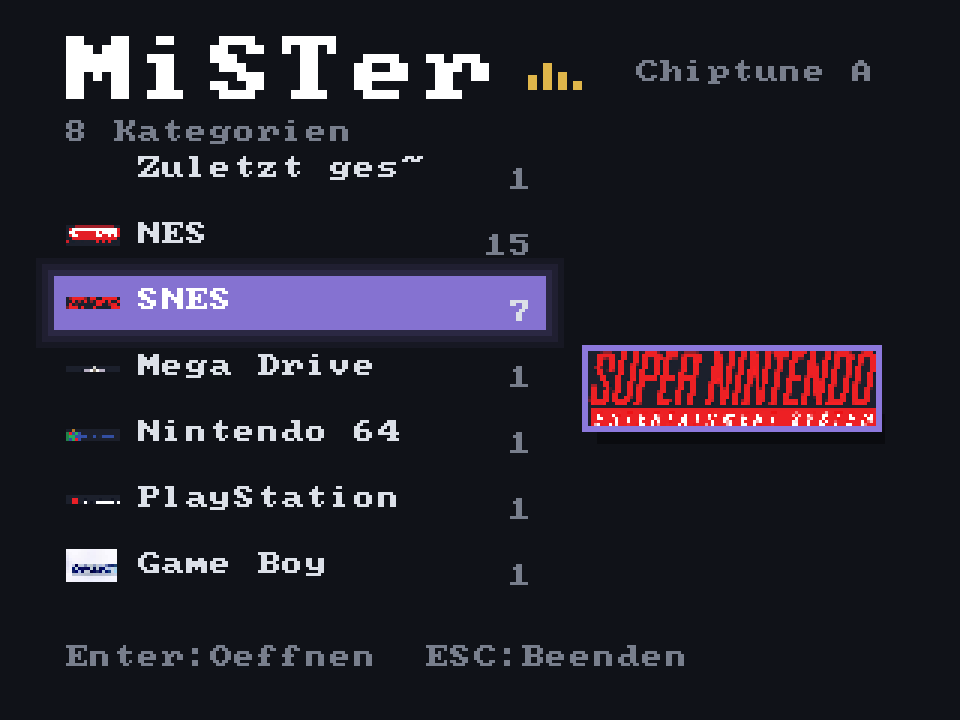
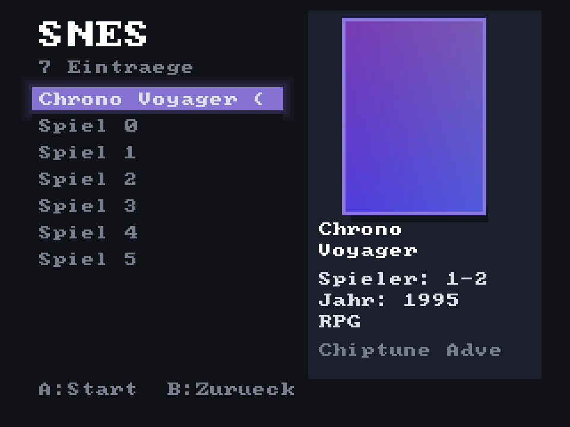

# MiSTer Custom Frontend v1.30 - Komplettbuild (Stand: 2026-07-23)

**Ersteller: Dragrem2K**

Ein selbstgebautes grafisches Frontend fuer den MiSTer FPGA: Spiele-Browser
mit Boxart und Spielinfos, Gamepad- und Tastatursteuerung, Hintergrundmusik,
Sprachumschaltung Deutsch/Englisch, eigene Tastenbelegung, CRT- und
HDMI-Unterstuetzung, Autostart - komplett in reinem Standard-Python, ohne
eine einzige externe Abhaengigkeit auf dem MiSTer selbst.

**Hinweis zu den Screenshots unten:** direkt aus dem echten Programmcode
gerendert (keine Fotomontage) - Boxart und Musiktitel im Beispiel sind
Platzhalter, die Systemlogos in der linken Spalte sind echt.

<p align="center">
  
  &nbsp;&nbsp;
  
</p>
<p align="center"><sub>Links: Kategorien-Menue mit Mini-Icons, Akzentfarbe und Now-Playing-Anzeige &nbsp;|&nbsp; Rechts: Spieleliste mit Boxart, Glow-Effekt und Schlagschatten</sub></p>

## Inhaltsverzeichnis

1. Paketinhalt
2. Voraussetzungen
3. Installation Schritt fuer Schritt
4. Bedienung
5. Hintergrundmusik einrichten
6. Boxart und Spielinfos laden
7. System-Hintergrundbilder (optional)
8. CRT-Bildschirme (15 kHz) einrichten
9. Sprache umschalten
10. Eigene Tastenbelegung
11. Boot-Animation (Startvideo)
12. Stream-Overlay für OBS (optional)
13. Fehlerbehebung
14. Bekannte Grenzen

---

## 1. Paketinhalt

| Datei                          | Zielort auf dem MiSTer          | Zweck |
|----------------------------------|----------------------------------|-------|
| frontend/frontend.py            | /media/fat/frontend/             | Das Frontend selbst (v1.30) |
| frontend/frontend_boot.sh       | /media/fat/frontend/             | Autostart-Wrapper (bei jedem Boot) |
| frontend/mister_boxart.py       | /media/fat/frontend/             | Boxart-Downloader (laeuft auf dem MiSTer) |
| frontend/mister_gameinfo.py     | /media/fat/frontend/             | Spielinfo-Downloader (laeuft auf dem MiSTer) |
| frontend/stream_server.py       | /media/fat/frontend/             | Web-Server fuers Stream-Overlay (optional) |
| frontend/stream_overlay.html    | /media/fat/frontend/             | OBS-Browser-Quelle (optional) |
| frontend/stream_admin.html      | /media/fat/frontend/             | Stream-Overlay-Konfiguration (optional) |
| Scripts/start_frontend.sh       | /media/fat/Scripts/              | Frontend manuell aus dem MiSTer-OSD starten |
| Scripts/update_frontend.sh      | /media/fat/Scripts/              | Nach einem Datei-Update sauber neu starten (1 statt mehrerer Befehle) |
| Scripts/boxart_download.sh      | /media/fat/Scripts/              | Boxart-Download aus OSD/Frontend starten |
| Scripts/gameinfo_download.sh    | /media/fat/Scripts/              | Spielinfo-Download aus OSD/Frontend starten |
| Scripts/stream_toggle.sh        | /media/fat/Scripts/              | Stream-Overlay an/aus schalten (optional) |
| PC-Tools/art_convert.py         | bleibt auf dem PC (Python+Pillow) | Bilder -> .art-Format, inkl. Hintergrundbilder |
| PC-Tools/boxart_fetch.py        | bleibt auf dem PC (optional)      | Alternative: Boxart-Download am PC statt MiSTer |
| PC-Tools/video_to_bootanim.py   | bleibt auf dem PC (Python+Pillow) | Video/Bildfolge -> Boot-Animation |
| music/                          | (nur als Hinweis, Inhalt egal)    | Zielordner fuer deine eigenen MP3s |

## 2. Voraussetzungen

- Ein MiSTer FPGA mit aktueller Firmware (Python 3 ist immer
  vorinstalliert)
- Netzwerkzugriff per SSH (`ssh root@<MiSTer-IP>`) und WinSCP (oder ein
  anderer SFTP-Client) zum Kopieren der Dateien
- Fuer Hintergrundmusik: `mpg123` muss auf dem MiSTer vorhanden sein.
  Pruefen per SSH: `which mpg123` - liefert es einen Pfad zurueck
  (z.B. `/usr/bin/mpg123`), ist alles bereit.
- Fuer die PC-Tools (optional): Python 3 und `pip install Pillow`

## 3. Installation Schritt fuer Schritt

1. Auf dem MiSTer per WinSCP anlegen: `/media/fat/frontend/`
2. Alle Dateien aus dem Ordner `frontend/` dorthin kopieren.
3. Alle Dateien aus dem Ordner `Scripts/` nach `/media/fat/Scripts/`
   kopieren.
4. Per SSH einmalig den Autostart einrichten, damit das Frontend bei
   jedem Einschalten automatisch erscheint:
   ```bash
   chmod +x /media/fat/frontend/frontend_boot.sh
   echo '/media/fat/frontend/frontend_boot.sh &' >> /media/fat/linux/user-startup.sh
   ```
5. MiSTer einmal neu starten - das Frontend sollte automatisch
   erscheinen.

Manueller Start (z.B. zum Testen, ohne neu zu booten), per SSH:
```bash
python3 /media/fat/frontend/frontend.py
```

Oder jederzeit aus dem echten MiSTer-OSD heraus: Hauptmenue -> Scripts
-> `start_frontend` (das Skript aus Schritt 3 macht das moeglich - MiSTer
listet automatisch jedes `.sh`-Skript in `/media/fat/Scripts/` im OSD).

## 4. Bedienung

Das Frontend hat zwei Seiten: Seite 1 (Hauptmenue) zeigt nur die
Kategorien (Systeme, Arcade, Scripts, System) als grosse Liste; Enter/A
oeffnet eine Kategorie auf Seite 2, wo links die Spiele-/Eintragsliste
steht und rechts bei Spiele-Systemen eine breite Boxart+Info-Spalte.

| Eingabe                          | Funktion |
|-------------------------------------|----------|
| Hoch/Runter                        | Einzelne Position navigieren (beschleunigt beim Halten: 1->2->4->10) |
| Links/Rechts                       | Seitenweise blaettern (waechst beim Halten: 1->2->3->5 Bildschirmseiten) |
| Enter/A                            | Kategorie oeffnen bzw. Spiel/Script starten |
| ESC/B                              | Eine Ebene zurueck; im Hauptmenue: Beenden-Bestaetigung |
| Ein Buchstabe (Tastatur, A-Z)      | Direktsprung zum naechsten Eintrag mit diesem Anfangsbuchstaben |
| F12 / Guide-Button                 | Echtes MiSTer-OSD oeffnen (Joystick-Belegung, ini-Settings) |
| F10 / X-Button                     | Aus dem OSD zurueck ins Frontend |
| Y-Taste                            | Naechster Song (manueller Musik-Wechsel) |
| F11                                 | Zufaelliges Spiel/Kategorie ("weiss nicht was ich spielen soll") |
| 3x Select nacheinander (Pad)       | Beenden-Bestaetigung (wie ESC) |
| Im laufenden Spiel: F12 -> "Exit to Menu Core" | Zurueck ins Frontend (siehe Hinweis unten) |

Wichtiger Hinweis zum Zurueckkehren aus einem laufenden Spiel: Sobald
ein Core laeuft, beansprucht MiSTer die Tastatur exklusiv auf
Kernel-Ebene - das haben wir mit einem direkten, vom Frontend
unabhaengigen Test bestaetigt (`cat /dev/input/eventX` liefert waehrend
des Spiels 0 Bytes, egal welche Taste gedrueckt wird). Weder F10 noch
eine Start+Select-Kombo koennen deshalb JEMALS waehrend des Spiels
selbst abgefangen werden - das ist eine Plattformgrenze, kein
Frontend-Bug. Der einzige zuverlaessige Weg: die echte MiSTer-Menue-
Taste (Standard F12, oder die Menue-Taste an deinem Pad) oeffnet
MiSTer's eigenes On-Screen-Menue ueber dem laufenden Spiel - das kann
MiSTer trotz der Tastatursperre, weil es die eigene Firmware ist. Dort
"Exit to Menu Core" waehlen; sobald MiSTer wirklich ins Menue
wechselt, erkennt das Frontend das automatisch und uebernimmt wieder.

## 5. Hintergrundmusik einrichten

1. Eigene MP3-Dateien nach `/media/fat/music/` kopieren (Ordner ggf.
   selbst anlegen).
2. Frontend neu starten - die Wiedergabe beginnt automatisch, zufaellig
   gemischt.
3. Steuerung:
   - Y-Taste: naechster Song
   - System -> "Music: On/Off": Musik komplett ein-/ausschalten
     (Status bleibt ueber Neustarts erhalten)
   - Musik pausiert automatisch, sobald ein Spiel oder Script startet,
     und laeuft automatisch weiter, sobald du zurueck im Frontend bist
4. Der aktuell spielende Titel laeuft als Laufschrift oben neben dem
   "MiSTer"-Logo (Hauptmenue) und unterhalb der Spielinfos im
   Boxart-Block (Kategorie-Ansicht).

Ohne MP3s im Ordner oder ohne `mpg123` bleibt das Frontend einfach
stumm - es gibt keine Fehlermeldung, es laeuft nur ohne Musik weiter.

## 6. Boxart und Spielinfos laden

Direkt auf dem MiSTer, kein PC noetig (auch aus der Scripts-Kategorie
im Frontend selbst startbar):
```bash
python3 /media/fat/frontend/mister_boxart.py            # Cover, CRT-Groesse
python3 /media/fat/frontend/mister_boxart.py hd          # zusaetzlich scharfe Cover fuer HDMI
python3 /media/fat/frontend/mister_gameinfo.py           # Jahr/Genre/Spieleranzahl
```
- Beide Skripte durchsuchen deine ROM-Ordner (SD-Karte und angeschlossene
  USB-Laufwerke) und holen passende Daten automatisch von
  thumbnails.libretro.com bzw. der libretro-database (jeweils mit
  GitHub-Spiegel als Fallback)
- Namensabgleich: exakt -> ohne Regions-Tags -> Aehnlichkeitssuche,
  bevorzugt in dieser Reihenfolge: Germany > Europe > World > USA > Japan
- Jederzeit mit Strg+C abbrechbar, setzt beim naechsten Start genau
  dort fort, wo es aufgehoert hat (vorhandene Dateien werden
  uebersprungen)
- ROMs ohne gefundenes Cover landen in `fehlend_<System>.txt` im
  jeweiligen `art`-Ordner unter `/media/fat/frontend/`

Alternative fuer den PC (`PC-Tools/boxart_fetch.py`, braucht
`pip install Pillow`): dieselbe Quelle vom Rechner aus abfragen und
die fertigen `.art`-Dateien per WinSCP hochladen. Nuetzlich fuer
eigene Bildquellen (z.B. emumovies.com) - dafuer wandelt
`PC-Tools/art_convert.py` beliebige PNG/JPGs ins `.art`-Format um:
```
python art_convert.py --images "meine_bilder/SNES" --roms "D:\roms\SNES" --out "art_out\SNES" --profile sd
```

## 6b. Automatische Listen-Bereinigung + kuratierte Liste

Der Spiele-Scan raeumt seit v1.23 automatisch auf, ohne deine eigene
Ordnerstruktur anzutasten:
- Geht beliebig tief (nicht mehr nur 2 Ordnerebenen) - eigene
  Sortierungen wie "1 TOP 100/Unterordner/Spiel.chd" werden vollstaendig
  gefunden.
- Bekannte Boot-/Test-Dateien (`boot.rom`, `mister-boot.*` usw.) werden
  ausgeblendet.
- Beta/Proto/Demo/Hack/Bad-Dump-Tags werden ausgefiltert.
- Mehrfach-Regionen desselben Spiels ("Spiel (USA)", "Spiel (Europe)",
  "Spiel (Germany)") werden zu EINEM Eintrag zusammengefasst - beste
  Region gewinnt (Germany > Europe > World > USA > Japan). Bei
  vollstaendigen No-Intro-Sets kann das die Listengroesse deutlich
  reduzieren und verhindert doppelte Boxart-Downloads fuer dasselbe
  Spiel.

Zusaetzlich optional im System-Menue: **"Curated list (DB-matched
only)"** zeigt nur Spiele mit einem Treffer in der libretro-Datenbank
(siehe Abschnitt 6) - so wie frueher bei Hyperspin die XML-Datenbank
pro System. Hat ein System noch gar keine Metadaten geladen, wird es
NICHT gefiltert (kein Risiko einer leeren Liste). Wirkt sofort, ohne
Neustart.

## 7. System-Hintergrundbilder (optional)

Fuer ein Konsolenfoto als abgedunkelten Hintergrund pro System:
gemeinfreie Fotos von Evan Amos (Wikimedia Commons, Suche nach
"Vanamo Online Game Museum") eignen sich hervorragend.
```
python art_convert.py --bg --images nes.jpg --out NES_320x240.art --size 320x240 --darken 0.25
```
Nach `/media/fat/frontend/bg/` kopieren. Systemkeys: NES, SNES, Genesis,
N64, PSX, GAMEBOY, GBA, SMS, TGFX16, MegaCD, Saturn, NEOGEO, ARCADE.

## 7b. System-Artbox im Kategorien-Menue

Im Kategorien-Hauptmenue (Seite 1) erscheint rechts neben der Liste
eine Artbox mit dem Logo/Cover des gerade markierten Systems - wechselt
live beim Hoch/Runter-Blaettern durch die Kategorien.

**Bereits im Build enthalten** (liegt in `frontend/sysart/`, muss nicht
mehr selbst erzeugt werden): alle 13 aktuell unterstuetzten Systeme
(NES, SNES, Genesis, N64, PSX, GAMEBOY, GBC, GBA, SMS, TGFX16, MegaCD,
Saturn, NEOGEO) haben ein echtes Logo hinterlegt. Im Unterordner
`frontend/sysart/_weitere_systeme_noch_nicht_unterstuetzt/` liegen
ausserdem fertige Logos fuer neun Systeme, die aktuell noch nicht in
GAME_SYSTEMS eingetragen sind (Atari 5200/7800/Jaguar, ColecoVision,
Philips CD-i, Pico-8, Sega 32X, Super Game Boy, TurboGrafx-CD) -
bereit fuer den Tag, an dem diese Systeme ergaenzt werden.

Eigene/weitere Bilder erzeugen (derselbe Konverter wie fuer Boxart,
kein Hintergrund-Modus noetig):
```
python art_convert.py --images konsolen_logo.png --out SMS.art --profile hd
```
Datei nach `/media/fat/frontend/sysart/<Systemkey>.art` kopieren (z.B.
`sysart/SMS.art`, `sysart/NES.art`). Ohne passende Datei erscheint ein
dezenter Platzhalter statt eines Fehlers - kann also nach und nach
befuellt werden.

## 8. CRT-Bildschirme (15 kHz) einrichten

Fuer das Menue/Frontend auf einem 15-kHz-Roehrenbildschirm sorgt dieser
Block am Ende der `/media/fat/MiSTer.ini` (wird ueber System ->
"Menu video: HDMI -> switch to CRT" im Frontend automatisch verwaltet,
muss also normalerweise nicht von Hand eingetragen werden):
```ini
[Menu]
vga_scaler=1
fb_terminal=1
video_mode=320,8,32,24,240,4,3,16,6048
```
Wichtig zu wissen: Der Scaler kann nur EINEN Modus gleichzeitig - das
Menue ist daher ENTWEDER auf dem CRT ODER auf HDMI sichtbar (Spiele
selbst laufen weiterhin auf beiden Ausgaengen gleichzeitig,
unabhaengig vom Menue).

## 8c. Zuletzt gespielt, Mini-Icons, Lade-Fortschritt (seit v1.30)

Automatisch aktiv, keine Einrichtung noetig:
- **"Zuletzt gespielt"**: neue Kategorie ganz oben im Hauptmenue,
  sobald du das erste Spiel gestartet hast - bis zu 15 Eintraege,
  neuestes zuerst. Erscheint automatisch erst NACH dem ersten
  Spielstart (vorher unsichtbar, keine leere Kategorie).
- **Mini-Icons**: kleine Vorschaubilder aus den bereits vorhandenen
  `sysart/`-Logos vor jedem Kategorienamen. Fehlt fuer ein System die
  Datei, bleibt die Spalte einfach leer statt eines Fehlers.
- **Lade-Fortschritt**: zeigt einen Fortschrittsbalken, falls die
  Spieleliste tatsaechlich neu von der Platte eingelesen werden muss
  (erster Start oder nach Aenderungen an den ROM-Ordnern). Beim
  normalen, schnellen Cache-Treffer (der ueblichste Fall) erscheint
  gar nichts davon - kein Tempoverlust im Alltag.

## 8b. Optische Verfeinerungen (seit v1.29)

Automatisch aktiv, keine Einrichtung noetig:
- **Pro-System-Akzentfarbe**: Markierung, Boxart-Rahmen und Artbox-
  Rahmen faerben sich passend zum aktuellen System (NES-Rot,
  Sega-Blau, SNES-Lila usw.) statt immer Standard-Blau zu zeigen.
- **Pulsierende Markierung**: dezentes, bewusst LANGSAMES Aufhellen/
  Abdunkeln der Auswahl (mehrere Sekunden pro Zyklus).
- **Glow-Effekt** um die Markierung, **Schlagschatten** unter dem
  Boxart-Cover.
- **Equalizer-Balken** neben der Now-Playing-Anzeige, solange Musik
  laeuft (rein animiert, keine echte Lautstaerke-Messung).

Falls das auf deinem Setup zu unruhig wirkt: alle vier Effekte lassen
sich einzeln im Code abschalten (`accent_for()`/`_pulsed()`/
`glow_border_fast()`/`_draw_equalizer()` jeweils durch die alte feste
Farbe ersetzen) - sag Bescheid, falls du dafuer einen eigenen
Menueschalter haben moechtest.

## 9. Sprache umschalten

System -> "Language: English -> switch to German" (bzw. umgekehrt auf
Deutsch) schaltet alle sichtbaren Texte im Frontend um - Kopf-/
Fusszeilen, System-Menue, Beenden-Dialog, Boxart-Infos, Now-Playing.
Der gewaehlte Stand bleibt ueber Neustarts erhalten.

## 10. Eigene Tastenbelegung

System -> "Configure buttons" startet einen Assistenten: er fragt
nacheinander nach Hoch, Runter, Links, Rechts, OK/Start, Zurueck,
MiSTer-Menue oeffnen - einfach die gewuenschte Taste druecken
(Tastatur oder Gamepad, egal welches Geraet). Meldet dein Pad das
D-Pad als Analogachse (die meisten tun das), wird das automatisch
erkannt und uebersprungen, da diese Richtung dann schon nativ
funktioniert. ESC bricht jederzeit ab, ohne die bisherige Belegung
zu aendern. System -> "Reset to default buttons" setzt alles wieder
auf die Werkseinstellung zurueck.

## 11. Boot-Animation (Startvideo)

Eine kleine Bildsequenz, die einmal pro MiSTer-Boot abgespielt wird,
bevor das normale Menue erscheint - kein echtes Videoformat (der MiSTer
hat keinen Video-Player), sondern ein "Daumenkino" aus Einzelbildern im
selben `.art`-Format wie Boxart und Hintergrundbilder.

1. Auf dem PC (`pip install Pillow`, fuer Video-Quellen zusaetzlich
   ffmpeg im PATH):
   ```
   # Aus einem Video (braucht ffmpeg):
   python video_to_bootanim.py --video intro.mp4 --out bootanim_out ^
       --fps 10 --duration 3 --size 320x240

   # Aus bereits vorliegenden Einzelbildern:
   python video_to_bootanim.py --frames-dir meine_frames --out bootanim_out ^
       --fps 12 --size 1920x1080
   ```
   `--size` an dein Menue anpassen: `320x240` fuer CRT, `1920x1080`
   fuer HDMI (siehe Abschnitt 8).
2. Den kompletten Inhalt von `bootanim_out` per WinSCP nach
   `/media/fat/frontend/bootanim/` kopieren.
3. Fertig - beim naechsten Boot erscheint die Animation automatisch
   einmal, danach wie gewohnt das Menue.

Ein beliebiger Tastendruck waehrend der Wiedergabe ueberspringt den
Rest sofort. Fehlt der Ordner oder ist er leer, passiert einfach
nichts - kein Fehler.

**Bewusst kurz halten:** Jedes Bild wird auf dem MiSTer in reinem
Python dekodiert - fuer ein paar Sekunden Animation problemlos
schnell genug, aber keine Videowiedergabe im eigentlichen Sinn.
Empfehlung: 2-4 Sekunden, 8-12 Bilder/Sekunde (also ca. 20-40
Einzelbilder insgesamt). Laenger geht, verlaengert dann aber auch
den Bootvorgang entsprechend.

## 12. Stream-Overlay für OBS (optional)

Ein Web-Overlay zeigt im Stream in Echtzeit, was gerade im Frontend
ausgewaehlt ist (Cover, Titel, System, Now-Playing) - unabhaengig vom
Video-Ausgang des MiSTers, also ohne die CRT/HDMI-Scaler-Grenze aus
Abschnitt 8. Die "Menue-Ansicht" fuer den Stream kommt dabei nicht aus
dem Videoausgang, sondern wird direkt im Browser gerendert und von OBS
ins Bild gesetzt.

**Einrichtung:**
1. Einschalten per SSH:
   ```bash
   /media/fat/Scripts/stream_toggle.sh on
   ```
   (legt nur eine Freigabe-Datei an - ohne sie startet der Web-Server
   gar nicht erst, bestehende Nutzer merken also nichts davon)
2. Frontend neu starten (siehe Abschnitt 11 - Fehlerbehebung fuer den
   sauberen Neustart-Ablauf).
3. In OBS eine **Browser-Quelle** hinzufuegen mit der Adresse
   `http://<MiSTer-IP>:8080/` (Breite/Hoehe auf deine Stream-Canvas
   einstellen, z.B. 1920x1080 - der Rest bleibt transparent).
4. Aussehen anpassen (Position, Farben, was angezeigt wird) unter
   `http://<MiSTer-IP>:8080/admin` im Browser - Aenderungen wirken
   sofort, ganz ohne Neustart.
5. Wieder ausschalten: `stream_toggle.sh off` + Frontend neu starten.

Laeuft komplett ueber Standard-Python (`http.server` + Server-Sent-
Events), keine externen Pakete, als eigener Hintergrund-Thread neben
der normalen Frontend-Schleife - bindet auf Port 8080 im lokalen
Netzwerk. **Nicht** ins Internet weiterleiten, es gibt keine
Authentifizierung. Technische Details fuer Weiterentwicklung:
`STREAM_fuer_Dennsen.md` (Einrichtung) und `STREAM_fuer_Dragrem.md` (Technik).

## 13. Fehlerbehebung

- **Nach einem Datei-Update** (neue Version installiert): einfach
  `/media/fat/Scripts/update_frontend.sh` ausfuehren (per SSH oder aus
  dem MiSTer-OSD unter Scripts) - beendet die alte Instanz sauber und
  startet automatisch neu. Ersetzt den manuellen
  `kill`/`rm`/`python3`-Dreischritt durch einen einzigen Befehl.
- Frontend startet nicht / reagiert nicht: Pruefen, ob schon eine
  Instanz laeuft: `cat /tmp/frontend.lock`. Beenden mit
  `kill $(cat /tmp/frontend.lock)`, dann `rm -f /tmp/frontend.lock`.
  (Hinweis: `pkill`/`pgrep` gibt es auf dem MiSTer NICHT - immer den
  `kill $(cat ...)`-Weg nutzen.)
- Notaus bei Autostart-Problemen: `touch /media/fat/frontend/disable`
  und neu starten (Reaktivieren: Datei wieder loeschen).
- Diagnose: `/tmp/frontend.log` protokolliert Geraete, Aktionen und
  Fehler (begrenzt sich seit v1.27 automatisch auf max. ~512 KB, damit
  der (meist RAM-basierte) `/tmp`-Speicher nicht mit der Zeit
  vollaeuft):
  ```bash
  tail -50 /tmp/frontend.log
  ```
- Niemals ueber die WinSCP-Kommandozeile lange Programme starten (die
  Konsole meldet nach 15s "keine Daten mehr" und der Abbrechen-Knopf
  killt den Prozess) - immer eine echte SSH-Sitzung nutzen
  (`ssh root@<MiSTer-IP>`).

## 14. Bekannte Grenzen

- ROMs in ZIP-Archiven werden aktuell nicht gelistet.
- ROM-Suche geht maximal 2 Ordnerebenen tief (bewusst, fuer Tempo).
- Arcade zeigt Infos aus den MRA-Dateien, aber noch keine eigene Boxart.
- Menue nur auf einem Video-Ausgang gleichzeitig sichtbar (technische
  Grenze des MiSTer-Scalers, keine Frontend-Einschraenkung).
- Start+Select UND F10 funktionieren waehrend eines laufenden Spiels
  grundsaetzlich nicht - MiSTer beansprucht die Tastatur exklusiv,
  sobald ein Core laeuft (bestaetigt per direktem Geraetetest, siehe
  Abschnitt 4). Der einzige Weg zurueck: MiSTer's eigenes Menue per
  F12/Menue-Taste oeffnen, dort "Exit to Menu Core" waehlen.
- Die eigene Tastenbelegung erfasst nur diskrete Tasten (Tastatur-Tasten
  und Gamepad-Buttons); ein D-Pad, das als Analogachse ankommt,
  funktioniert bereits nativ und wird beim Assistenten automatisch
  uebersprungen statt umbelegt.

---

## Technik-Kurzfassung

Python 3 (nur Standardbibliothek) zeichnet direkt in den Framebuffer
`/dev/fb0` (mmap), liest Eingaben roh aus `/dev/input/event*` (mit
exklusivem Grab und Event-Injection fuer F9/F12), startet Cores und
Spiele ueber `/dev/MiSTer_cmd` bzw. generierte MGL-Dateien (Parameter
aus der mrext-Systemdatenbank) und erkennt die Rueckkehr ins Menue ueber
`/tmp/CORENAME`. Bilder liegen im eigenen `.art`-Format
(zlib-komprimierte BGRA-Rohpixel), das ohne Bildbibliothek direkt
geblittet werden kann; der Boxart-Downloader dekodiert PNGs dafuer mit
einem eigenen, in reinem Python geschriebenen Dekoder. Hintergrundmusik
laeuft ueber das externe `mpg123`-Kommandozeilenprogramm im Hintergrund
(subprocess), Sprachumschaltung ueber ein zentrales Uebersetzungs-
Woerterbuch, eigene Tastenbelegung ueber eine editierbare
Codes-zu-Aktionen-Zuordnung, die beim Start geladen und mit der
Standardbelegung zusammengefuehrt wird.

---

Erstellt von **Dragrem2K**.
