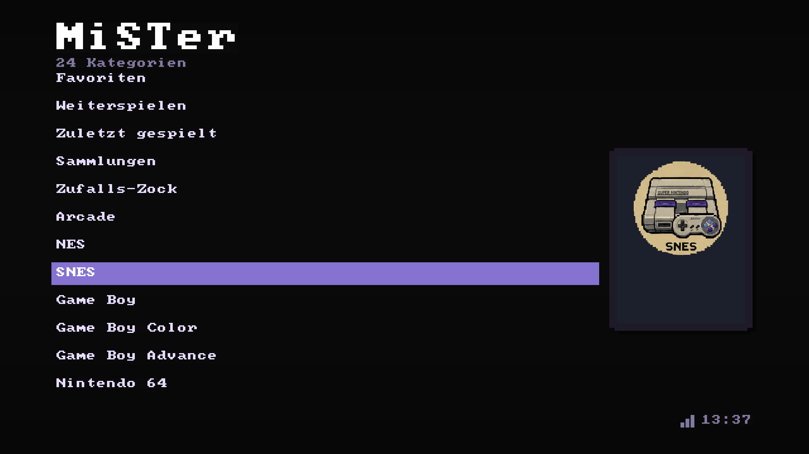
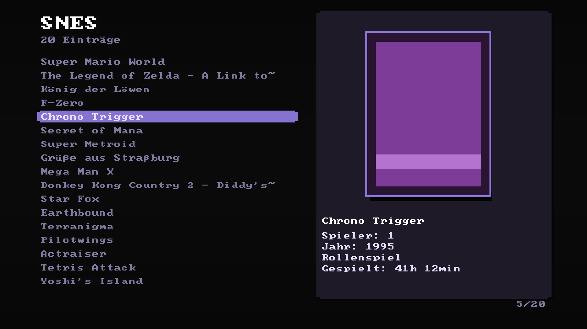
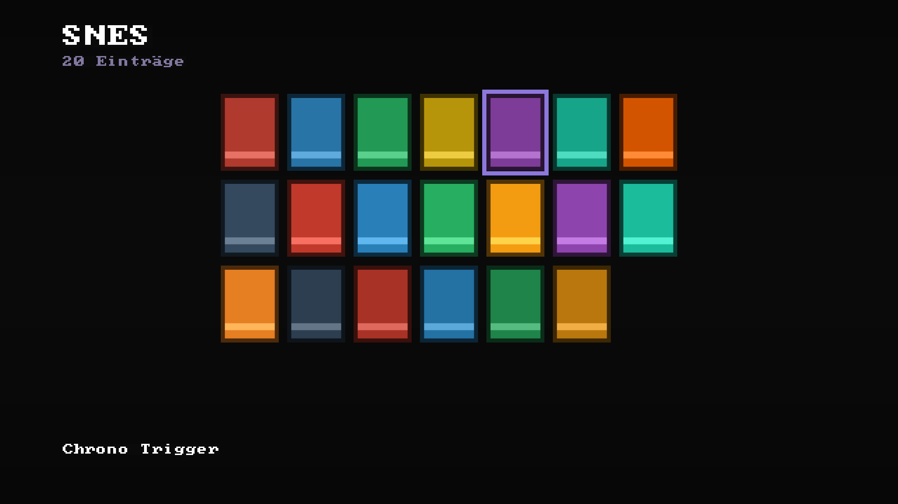
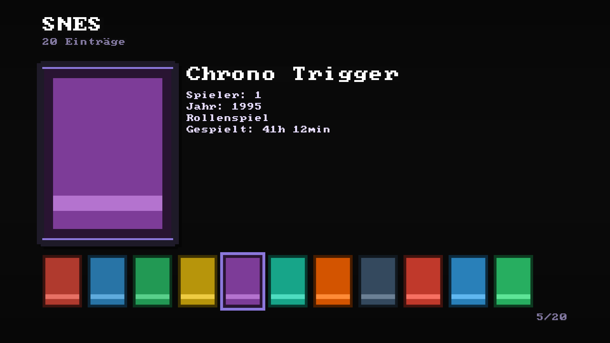
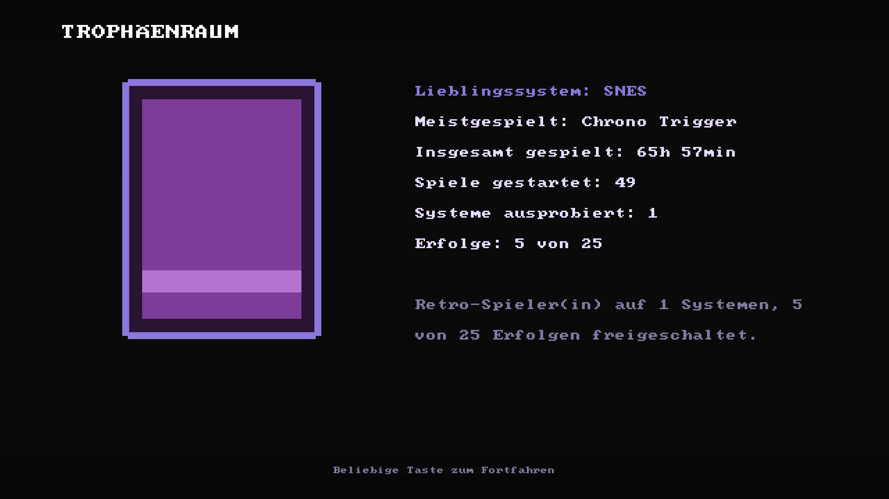

# Dragend — MiSTer Custom Frontend v4.8

**Von Dragrem2K**, mit Beiträgen von **TheRealSuTefan**, **Dfense** und
**Dennsen**.

🇬🇧 [English](README_EN.md) · 📖 [Handbuch](docs/HANDBUCH.md) ·
📄 [Anleitung als PDF](docs/Dragend_Anleitung.pdf) ·
📝 [Changelog](CHANGELOG.md)

Ein Spiele-Browser für den MiSTer FPGA: Boxart, Spielinfos, Gamepad- und
Tastatursteuerung, Hintergrundmusik, CRT und HDMI gleichwertig. Reines
Standard-Python, keine einzige zusätzliche Abhängigkeit auf dem MiSTer.

<p align="center">
  
  &nbsp;&nbsp;
  
</p>
<p align="center">
  
  &nbsp;
  
  &nbsp;
  
</p>
<p align="center"><sub>Liste, Raster, Galerie — und der Trophäenraum. Alle Bilder direkt aus dem Programmcode gerendert (<code>tools/screenshots_bauen.py</code>), Boxart und Spielstände sind Platzhalter.</sub></p>

---

## Neu in v4.8

Der längste Abstand zwischen zwei Veröffentlichungen in diesem Projekt.
Das Wichtigste in sechs Zeilen — alles Weitere im
[Changelog](CHANGELOG.md):

- **Die Hauptseite gehört dir.** Reihenfolge und Sichtbarkeit der
  Kategorien bestimmst du selbst, Filter dürfen einen **eigenen Namen**
  tragen.
- **Scrollen ist spürbar flüssiger** — ein Fünftel der Bytes auf den
  Schirm, Flächen, Rahmen, Text und Cover nach C verlagert, der
  Spitzenverbrauch beim Neueinlesen von 55 auf 24 MB. Jede Zahl auf dem
  Gerät nachgemessen.
- **Das Stream-Overlay ist erwachsen geworden:** die
  **Erfolgs-Einblendung** ist ein Moment statt einer Benachrichtigung,
  und daneben steht die **Erfolgs-Wand** — alle Erfolge des laufenden
  Spiels als Raster, die frisch freigeschaltete Kachel blitzt auf.
- **MiSTer wird mitbenutzt statt nachgebaut:** seine eigenen Favoriten,
  seine `.pf`-Schriften, seine Lochmasken, `update_all` aus dem Menü,
  der Core-Bericht „was ist neu", NFC-Tags über Zaparoo.
- **Sichtbare Politur:** eigene Hintergrundbilder, Hochkant (TATE),
  Theme-Editor, die Ziehung mit Ton, `--demo` als Vorführung und
  `--show` als Bericht.
- **Der Bildwächter** holt das Bild zurück, wenn MiSTer unter Kernel
  6.18 den Bildspeicher neu einrichtet.

---

## Installieren: eine Datei, ein Klick

1. [`Frontend_Install.sh`](https://raw.githubusercontent.com/dragrem2k-coder/mister-frontend/main/Scripts/Frontend_Install.sh)
   herunterladen (Rechtsklick → *Speichern unter*).
2. Nach `/media/fat/Scripts/` kopieren — per WinSCP oder mit der SD-Karte
   am PC.
3. Auf dem MiSTer: **Scripts → „Frontend Install"** ausführen.

Das Skript lädt alles Weitere selbst, richtet den Autostart ein und
startet das Frontend am Ende von allein. Kein SSH, kein Entpacken.

**Update:** dasselbe Skript noch einmal ausführen. Boxart, Musik und
Einstellungen bleiben unangetastet.

**Deinstallieren:** `Frontend_Uninstall.sh` — der MiSTer ist danach exakt
wie vorher. Es wird nichts am System verändert, kein Kernel, kein Image.

Ohne Internet am MiSTer, per SSH, oder von Hand: siehe
[Installation & Update (PDF)](docs/Installation_und_Update.pdf).

---

## Funktionen

### Sammlung

| | |
|---|---|
| **Drei Ansichten** | Liste, Raster, Galerie — für Spieleliste *und* Hauptseite, je Kategorie umschaltbar (F10 / Select+Y) |
| **Große Rasterkacheln** | Zehn Kacheln à 270×361 statt einundzwanzig à 176×235. Zurück zum kleinen Raster mit `touch /media/fat/frontend/raster_klein` |
| **Boxart & Spielinfos** | Eigene Sammlung unter `art/`, dazu die Datenbank unter `/media/fat/docs`, falls vorhanden. Download-Skript liegt bei |
| **Spielbeschreibungen** | Deutscher Text neben dem Cover in der Galerie |
| **Filter** | Nach Genre, Jahr, Spielerzahl und Entwickler (Tab / Select+L2+R2), je Kategorie merkbar — mit automatischem oder **eigenem Namen** |
| **Hauptseite einrichten** | Reihenfolge und Sichtbarkeit der Kategorien selbst bestimmen. „System“ bleibt immer, zuletzt |
| **Suche** | Tippen filtert die Liste sofort |
| **Listen-Bereinigung** | Boot-Dateien, Beta/Proto/Hack-Tags und doppelte Regionen fallen beim Einlesen weg — beste Region gewinnt. Dazu auf Wunsch „nur Spiele mit Datenbank-Treffer“ |
| **`gamelist.xml`** | Hast du dein ROM-Verzeichnis mit Skraper gepflegt, wird die Datei gelesen: Jahr, Genre, Spielerzahl, Hersteller, Beschreibung, Cover. Ohne Einstellung, und deine eigenen Daten haben immer Vorrang |
| **Favoriten & Sammlungen** | Eigene Listen quer über alle Systeme — **einschließlich der Favoriten, die du im MiSTer-OSD markiert hast** (eine Liste, zwei Quellen; in deine Favoritendatei wird nichts geschrieben) |
| **Zuletzt gespielt** | Eigene Kategorie, sortiert nach letztem Start |
| **ZIP-Archive** | ROMs in Archiven werden gefunden und gestartet, ohne je etwas zu entpacken |
| **Ordner mit einem Spiel** | Werden aufgelöst — wichtig bei PSX, Mega CD und Saturn, wo jedes Spiel in einem eigenen Ordner liegt |
| **ROMs auf NAS/USB** | Netzlaufwerke und USB-Nummern über 5 werden dynamisch gefunden |
| **NFC-Tags** | Zaparoo wird erkannt und gestartet; das Frontend nennt dir den Befehl für den Tag. In Zaparoos Ordner wird nichts geschrieben |
| **Speicher-Wächter** | Stick eingesteckt? Das Frontend sagt es — und liest auf Wunsch **nur das Geänderte** nach statt alles |

### Persönliches

| | |
|---|---|
| **Trophäenraum** | Profil-Bildschirm: meistgespieltes Spiel, Lieblingssystem, Erfolgs-Zähler |
| **Jahresrückblick** | Statistik für das laufende Kalenderjahr |
| **Spielzeit-Tracker** | Wie lange, wie oft, wann zuletzt — pro Spiel und pro System |
| **Top-10-Listen** | Nach Spielzeit, Startzahl, Systemen |
| **RetroAchievements** | Fortschritt, Erfolgs-Vitrine (F6), Popup bei neuen Erfolgen |
| **Durchgespielt & eigene Erfolge** | Auch für Spiele ohne RA-Unterstützung |
| **Easter Eggs & Frontend-Level** | Versteckte Erfolge, Jubiläums-Hinweise, saisonale Dekorationen |
| **Zufalls-Zock / Wonne oder Tonne** | Zufälliges, noch nicht gespieltes bzw. noch nicht bewertetes Spiel |
| **Ziehung mit Ton** | Beim Ziehen laufen die Titel wie auf einem Rad, dazu ein Ziehungssound — Dauer 1–5 s einstellbar oder ganz aus |

### Anzeige & Ton

| | |
|---|---|
| **CRT (15 kHz) und HDMI** | Beide mit eigener Optik und eigenem Layout, nicht als Nebeneffekt |
| **Hochkant (TATE)** | Eigene Aufteilung für gedrehte Bildschirme — die Kachelgröße wird gerechnet, nicht gesetzt |
| **Theme-Editor** | Farben im laufenden Betrieb ändern und speichern, ohne Datei von Hand |
| **Themes** | Farbschemata, Akzentfarbe, einstellbarer Bildrand |
| **System-Artbox** | Im Kategorien-Menü steht rechts das Logo des markierten Systems — alle 48 liegen bei |
| **Attract-Modus** | Bildschirmschoner mit Cover-Schau, Verzögerung 30 s bis 15 min |
| **Boot-Animation** | Eigenes Startvideo oder die eingebaute D-Pad-Animation |
| **Musik** | Eigene MP3s oder Rainwave-Internetradio (fünf Sender), gemeinsamer Lautstärkeregler |
| **Navigations-Sounds** | Selbst erzeugte Klänge, abschaltbar |
| **MiSTers eigene Schriften** | Die `.pf`-Zeichensätze aus `/media/fat/font` werden gelesen und im Frontend benutzt — dieselbe Schrift wie im OSD |
| **Lochmasken** | MiSTers eigene `.png`-Masken als Gitter über das Bild, vier Stärken |
| **Hintergrundbilder** | Eigene Bilder hinter der Liste, abgedunkelt und zugeschnitten; mehrere werden durchgeschaltet |
| **Feinheiten** | Scrollbalken rechts, Akzentbalken je Zeile, Haarlinie zur Coverspalte, Akzentstrich über der Liste — in einem Schalter zusammengefasst, Kosten gemessen (+0,04 ms je Scrollschritt) |
| **CRT-Testbild** | Zum Einstellen von Geometrie und Schärfe |

### Technik & Bedienung

| | |
|---|---|
| **Sprache** | Deutsch / Englisch, jederzeit umschaltbar |
| **Eigene Tastenbelegung** | Tastatur und Joypad frei belegbar |
| **Autostart** | An/aus, jederzeit im Menü |
| **Stream-Overlay für OBS** | Zeigt Spiel, Cover und Musiktitel im Browser; jede Zeile einzeln abschaltbar, Spieltitel inbegriffen. Die **Erfolgs-Einblendung** zeigt neue RA-Erfolge sofort — mit Warteschlange, zählenden Punkten und eigener Ecke. Dazu die **Erfolgs-Wand**: alle Erfolge des laufenden Spiels als Raster, die frisch freigeschaltete Kachel blitzt auf, und auf Wunsch läuft sie in einem festen Ausschnitt durch |
| **Bildschirmspiegel** | Auf CRT unterwegs? `:8080/mirror` zeigt den Frontend-Bildschirm im Browser — Handy, zweiter Monitor, Stream. Das laufende Spiel kommt vom FPGA und ist darin nicht zu sehen |
| **Uhrzeit** | MiSTer hat keine Batterieuhr; das Frontend holt die Zeit per SNTP, die Zeitzone stellst du einmal in halben Stunden ein |
| **Miniaturen vorbereiten** | Cover einmalig vorberechnen, damit nichts mehr nachlädt |
| **PC-Werkzeug** | Dieselbe Arbeit am Windows-PC statt auf dem MiSTer — aus Stunden werden Minuten (`pc_tools/`) |
| **C-Modul** | `libdragend.so` rechnet die Bildskalierung 100-fach schneller. Optional; fehlt sie, rechnet Python weiter |
| **Bildwächter** | Holt das Bild zurück, wenn MiSTer den Bildspeicher neu einrichtet und die Linux-Konsole durchscheint (Kernel 6.18) |
| **Miniaturen als JPEG** | Große Miniaturen werden platzsparend abgelegt — Ordner öffnen sich merkbar schneller |
| **Schutz beim Einlesen** | Symlink-Schleifen und zu tiefe Verschachtelungen werden erkannt statt endlos verfolgt |
| **`update_all` aus dem Menü** | Startet das vorhandene Skript; die Beschriftung nennt den letzten Lauf („vor 23 Tagen“) |
| **Core-Browser** | Je System die Core-Fassung wählen, mit Warnung, wenn die gewählte Datei von `update_all` gelöscht wurde |
| **Core-Updates: was ist neu** | Nach einem `update_all`-Lauf: welche Cores neu sind, geändert oder weg. Das Protokoll von `update_all` wird dafür **nicht** gelesen — verglichen wird der Stand der Core-Ordner vorher und nachher, und der ist richtig, egal in welcher Fassung `update_all` vorliegt |
| **Bericht über sich selbst** | `--show` sagt, was drin ist, wie es eingestellt ist und wie schnell es läuft — auf dem Fernseher und als Datei in `/tmp` |
| **Vorführung** | `--demo` führt das Frontend selbst vor: Ansichten, Filter, Trophäenraum und die Einstellungsgruppen |
| **Paket-Prüfung** | Ein halb eingespieltes Update endet in einer Anleitung, nicht in einem Absturz |

Alles ausführlich: **[Handbuch](docs/HANDBUCH.md)**.

---

## Bedienung, kurz

| Taste | Pad | |
|---|---|---|
| Pfeiltasten | D-Pad | Navigieren |
| Enter | A / Start | Auswählen, Ordner betreten |
| Esc | B / Select | Zurück |
| F2 oder `/` | Select + A | Suche |
| Tab | Select + L2/R2 | Filter |
| F6 | Select + X | Erfolgs-Vitrine |
| F7 / F8 | L2 / R2 | Durchgespielt / Favorit |
| F10 | Select + Y | Ansicht umschalten |
| F11 | — | Zufälliges Spiel starten |
| F12 | Guide / Mode | MiSTer-OSD öffnen |
| **F1** *(im Spiel)* | — | Zurück ins Frontend. Esc tut dasselbe, muss aber ~0,6 s gehalten werden |

**F9 ist absichtlich frei.** MiSTer benutzt sie selbst für den Wechsel
zwischen Konsole und Grafikmodus — das Frontend spielt sie sogar selbst
ein. Der Belegungs-Assistent lehnt sie deshalb ab.

Die vollständige Belegung steht in der
[Anleitung als PDF](docs/Dragend_Anleitung.pdf).

---

## MiSTer-Linux ab 07.09.2026 (Kernel 6.18) — läuft, ab Build 169

Das MiSTer-Linux-Update vom **7. September 2026** hebt den Kernel von
5.15.1 auf 6.18.x und hat dabei den Zugriff auf den Bildspeicher
geändert. Im MiSTer-Forum heißt es dazu, dass *„Front Ends have to be
patched due to framebuffer changes"* — **Degauss**, das **Zaparoo
Frontend** und **Console Mode** mussten alle nachziehen.

Erkennbar an dieser Zeile in `dmesg`:

```
fb0: sys_fillrect: framebuffer is not in virtual address space.
```

**Was auf diesem Kernel anders ist — nachgemessen, nicht vermutet:**

Beim Beenden schickt das Frontend ein F12, damit MiSTer sein OSD
zurückholt. Auf dem neuen Kernel **kommt dieses erste F12 nicht an.**
Aus dem Log eines Geräts mit 6.18.38:

```
Exit: injiziere F12 (1/3)
Exit: MiSTer bei   1% - das OSD ist NICHT gekommen, fasse nach
Exit: injiziere F12 (2/3)
Exit: MiSTer bei 100% - das OSD ist da
```

Deshalb prüft das Frontend seit Build 169 nach dem F12 an MiSTers
CPU-Last, ob das OSD wirklich da ist, und fasst bis zu dreimal nach.
Ohne das bleibt beim Beenden ein schwarzes Bild mit blinkendem Cursor
stehen, kurz darauf der Login-Gruß — genau das war das Symptom.

Dazu kommt ein Rückfall über `/dev/mem`, falls sich `/dev/fb0` auf
einem Gerät gar nicht mehr einblenden lässt (derselbe Weg, den Degauss
gebaut hat). Auf Geräten, wo das normale Einblenden noch geht, wird er
nie betreten.

**Und seit Build 184: der Start ist auf 6.18 wieder abgesichert.**
Gemeldet wurde nach dem Update *„ich hänge im OSD und höre die Musik
vom Frontend"*, dazu ein Login-Gruß, der nach 20–30 Sekunden Ruhe
zurückkam und bis zum nächsten Tastendruck stehen blieb. Ursache ist
dieselbe wie beim F12: **ein einzelnes F9 sitzt auf diesem Kernel
nicht mehr zuverlässig.** MiSTer richtet den Bildspeicher mehrfach neu
ein — im `dmesg` eines Geräts bei Sekunde 3, 41, 48 und 51 — und wer
vorher einmal klopft, klopft an eine Tür, die es noch nicht gibt.

Das Frontend schaltet deshalb **auf Kernel 6 und neuer automatisch**
die Konsolen-Mechanik aus den Builds 146–166 ein: das F9 wird
wiederholt, eine Wache räumt fremde Ausgabe im Bild weg, und die
Bildschirmschonung der Textkonsole bleibt aus. Auf 5.15.1 ändert sich
**nichts** — dort gilt weiterhin das Verhalten aus Build 145, das dort
seit Wochen läuft.

Erzwingen lässt sich beides, ohne auf einen Build zu warten:

```
touch /media/fat/frontend/konsole_mechanik_an     # immer an
touch /media/fat/frontend/konsole_mechanik_aus    # immer aus
```

Welcher Weg genommen wurde, steht in `/tmp/frontend.log`:
`Konsole: Mechanik AN (Kernel 6.18.38-MiSTer)`.

**Etwas kaputt?** Dann bitte das Messwerkzeug laufen lassen — es
braucht zwei Minuten, ändert nichts und sagt am Ende in Klartext,
woran es liegt:

```
python3 /media/fat/frontend/kernel_probe.py
```

**Lieber beim alten Kernel bleiben?** Geht auch:
`update_linux = false` in `/media/fat/downloader.ini`, dann `linux.img`
und `zImage_dtb` auf Release 20250402 (Kernel 5.15.1) zurücklegen.
`update_all` stellt inzwischen von selbst auf eine Distribution um, die
Linux auf einer stabilen Ausgabe hält — wer die neueste will, wählt
*MiSTer-devel (Edge Linux)* im Einstellungsbildschirm.

---

## Voraussetzungen

- MiSTer FPGA mit aktuellem Main und Linux-Image
- Freier Platz auf der SD-Karte: rund 20 MB für das Frontend, dazu die
  Boxart
- Für Downloads und Radio: Netzwerk. Alles andere läuft offline

Nicht nötig: SSH, ein zusätzliches Paket, eine Systemänderung.

---

## Warum ein eigenes Frontend?

Die übliche Sorge bei einem Frontend auf dem MiSTer ist die Leistung —
es gibt keine GPU, und die ARM-CPU ist ohnehin beschäftigt. Genau darin
lag der Schwerpunkt: der größere Teil der Arbeit floss nicht in
Funktionen, sondern in Messen und Nachbessern. Man soll das Menü im
Alltag nicht spüren.

Es gibt Alternativen, und sie sind gut: **Zaparoo Frontend** (größer,
von mehreren getragen, mit NFC-Tags) und **Taki Udons Console Mode**
(komplett per Controller, sehr zugänglich). Was hier anders ist:

- **Keine Systemänderung.** Ein Python-Programm auf einem unveränderten
  MiSTer. Eine Deinstallation lässt nichts zurück.
- **Keine Abhängigkeiten.** Nur die Python-Standardbibliothek.
- **CRT gleichwertig zu HDMI**, nicht als Nebeneffekt.
- **Die Sammlung soll sich lebendig anfühlen**, nicht nur schnell
  bedienbar sein — Trophäenraum, Jahresrückblick und Spieltagebuch sind
  der eigentliche Kern, kein Beiwerk.

Ehrlich gesagt: ein Hobbyprojekt, kein Team-Produkt. Weniger getestete
Aufbauten als bei einem großen Community-Projekt, dafür sehr genau auf
die eigene, täglich genutzte Hardware abgestimmt.

---

## Selbst nachmessen: `--bench`

Ab Build 177 kann das Frontend sich selbst vermessen — ein fester,
wiederholbarer Ablauf statt Handarbeit mit Profilschalter und
Logdatei:

```
killall -q python3                         # laufendes Frontend beenden
python3 /media/fat/frontend/frontend.py --bench
```

Der Bericht erscheint auf der Konsole und landet zusätzlich in
`/tmp/dragend_bench.txt`. Er dauert je nach Gerät zwei bis vier Minuten
und besteht inzwischen aus elf Abschnitten — jeder ist entstanden, weil
eine Zahl fehlte, die eine Entscheidung gebraucht hätte:

| | |
|---|---|
| **A Start** | Wie lange der Start dauert — auch **je Spiel**, damit 2 000 und 97 000 Spiele vergleichbar bleiben |
| **B Zeichnen** | Voller Seitenaufbau und Zeit je Scrollschritt, für alle drei Ansichten auf beiden Seiten. Getrennt nach **kalt / von der Karte / warm**, mit Aufteilung des kalten Falls in Dekodieren, Verkleinern und Rest |
| **C Bildkette** | Verkleinern in C gegen Python, Miniatur packen, schreiben, lesen, PNG dekodieren — an einem **erzeugten** Bild fester Größe und damit zwischen Geräten direkt vergleichbar |
| **D Echte Datei** | Dasselbe an einem Cover von der Karte. Hängt an genau dieser Datei und ist ausdrücklich **nicht** vergleichbar — der Unterschied zu C ist selbst die Auskunft |
| **E Scroll-Blitting** | Ob sich das Verschieben des Listenblocks gegenüber dem Neuzeichnen lohnt. Misst abwechselnd über drei Runden und sagt **„zu knapp"**, wenn der Unterschied in der Streuung liegt |
| **F Bildspeicher lesen** | Was ein Blick des Bildwächters kostet — der Posten, der in Build 209 einmal 2 ms je Bild gekostet hat |
| **G Dateisystem** | `os.stat` und `os.utime` im Zeichenweg, mit und ohne Zwischenspeicher |
| **H Übertragungs-Matrix** | Preis je Megabyte und je Aufruf, in acht Größen — die Grundlage für jede Entscheidung über Teilkopien |
| **I Kurze Zeilen gegen lange** | Warum der Rechteck-Flip lohnt, und ab welcher Fläche das Füllen nach C gehört |
| **J Woraus besteht ein Scrollschritt** | Jeder Posten einzeln: Wiederherstellen, Kopieren, Flip, Text, Karten, Cover — und der **Rest**. Bleibt der groß, fehlt noch ein Posten |
| **K Welche Füllaufrufe** | Jeder äußerste Füllaufruf mit Maß, Anzahl und Zeit, je Ansicht zweimal: mit Cover und mit übersprungenem Cover (so, wie es sich beim Schnellscrollen verhält). Der größte Posten steht neben dem, was seine Fläche nach dem Kostenmodell erklärt |

Die Abschnitte J und K sind der Grund, warum hier überhaupt etwas
schneller geworden ist: sie nennen den **größten Einzelposten mit Namen
und Zahl**, statt eine Gesamtzeit zu zeigen. Und sie haben mehr als
einmal einen Fehler im Messwerkzeug selbst überführt — zuletzt in
Build 245, als sich zeigte, dass Abschnitt K den Fall gar nicht
herstellte, in dem die Verbesserung aus Build 244 überhaupt greift.

Der Lauf **schreibt nichts auf die SD-Karte**. Keine Miniatur, keine
Einstellung, keine Cache-Datei; was er zum Messen schreiben muss,
landet in einem temporären Ordner, der danach wieder verschwindet.

Wenn etwas klemmt und du eine Rückmeldung schickst: `--bench` ist das
Nützlichste, was mitkommen kann. Es sagt in einer Datei, auf welchem
Gerät, mit welcher Auflösung, mit oder ohne C-Modul gemessen wurde —
genau die Angaben, die sonst jedes Mal nachgefragt werden müssen.

**Ergebnisse auf dem DE10-Nano:** [docs/MESSUNG.md](docs/MESSUNG.md) — unter anderem C gegenüber Python beim Verkleinern: Faktor 121–124, über drei Läufe innerhalb von 2 %.

---

## Wo was liegt

| | |
|---|---|
| `frontend/` | Das Programm. `frontend.py` plus das Paket `fe/` |
| `frontend/c/` | Das optionale C-Modul samt Bauanleitung |
| `Scripts/` | Installer, Deinstaller, Boxart-Download |
| `pc_tools/` | Das Windows-Werkzeug für die Miniaturen |
| `tools/` | Tests und Diagnosewerkzeuge |
| `docs/` | Handbuch, PDFs, Changelog-Archiv |

---

## Hilfe

Läuft etwas nicht, steht die Fehlersuche im
[Handbuch](docs/HANDBUCH.md#13-fehlerbehebung). Das Frontend schreibt
mit nach `/tmp/frontend.log` — diese Datei ist bei einer Meldung das
Nützlichste, was man mitschicken kann.

Lizenz: [MIT](LICENSE).
