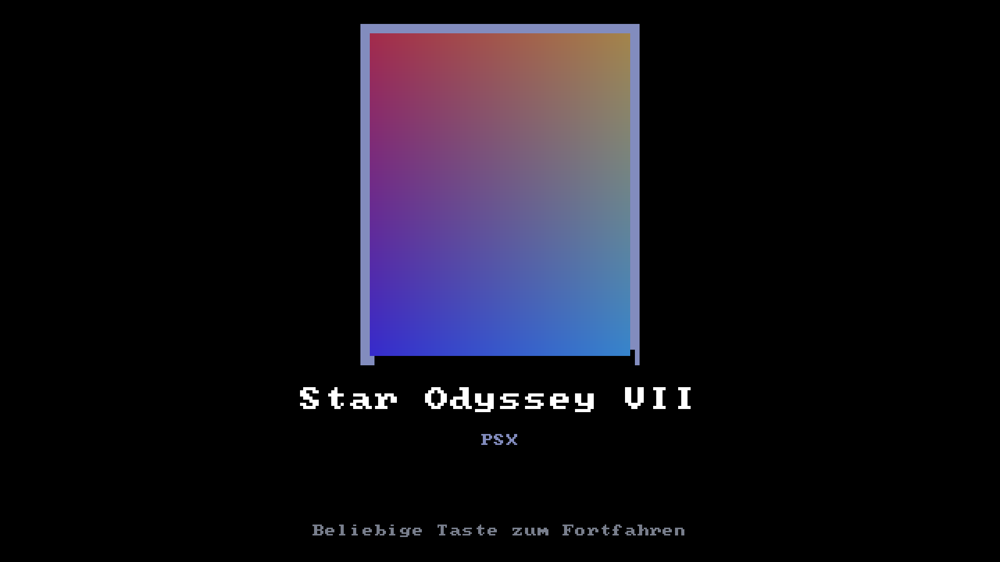

# MiSTer Custom Frontend — Vorschau (Stand v3.9)

Mein selbstgebautes Frontend für den MiSTer FPGA, komplett in purem
Standard-Python — keine einzige externe Abhängigkeit auf dem MiSTer
selbst. Gebaut von Dragrem2K, mit Beiträgen von TheRealSuTefan,
Dfense und Dennsen.

  
  &nbsp;&nbsp;
  

  
  &nbsp;&nbsp;
  

Links: Ordner-Navigation — Boxart erscheint auch auf Ordner-Ebene bei Mehrfach-CD-Spielen &nbsp;|&nbsp;
Rechts: Attract-Modus — nach kurzer Untätigkeit zeigt das Menü von selbst eine Diashow der eigenen Sammlung

  
  &nbsp;&nbsp;
  

Links: Trophäenraum — Cover des meistgespielten Spiels, Lieblingssystem, Erfolgs-Zähler &nbsp;|&nbsp;
Rechts: Jahresrückblick — eingegrenzt auf das laufende Kalenderjahr, nicht "seit Aufzeichnungsbeginn"

*Screenshots direkt aus dem echten Programmcode gerendert, keine
Fotomontage.*

---

## Was es kann

### Navigation & Darstellung
- Zwei Ebenen: Kategorien (Systeme, Arcade, Scripts, System) und
  Spieleliste, dazwischen beliebig tiefe **Ordner-Navigation** — deine
  eigene Ordnerstruktur (z. B. "1 US-A-E", Mehrfach-CD-Ordner) wird 1:1
  übernommen, statt alles in eine lange Liste zu quetschen
- Boxart erscheint automatisch auch auf Ordner-Ebene, wenn der Ordner
  einem katalogisierten Spiel entspricht (typisch bei PSX-Sammlungen
  mit einem Unterordner pro Spiel)
- **"Weiterspielen"** ganz oben im Hauptmenü — schlägt gezielt das
  Spiel vor, das du zuletzt gestartet, aber noch nicht als
  durchgespielt markiert hast
- "Zuletzt gespielt" — bis zu 15 zuletzt gestartete Spiele, systemübergreifend
- **Favoriten** — eigene, bewusst kuratierte Auswahl (F8/L2-Taste),
  unabhängig von "Zuletzt gespielt"
- **Attract-Modus**: nach kurzer Untätigkeit zeigt das Menü von selbst
  eine Diashow der eigenen Sammlung — großflächiges Cover, wechselt
  automatisch weiter, jede Taste beendet es sofort
- CRT (15 kHz) und HDMI werden automatisch erkannt, mit jeweils
  eigens abgestimmter Optik und Geschwindigkeit — dazu ein eingebautes
  CRT-Testbild (Geometrie, Linearität, Farbabgleich) im System-Menü
- Akzentfarben pro System, pulsierende Auswahl-Markierung mit
  Glow-Effekt, animierter Equalizer bei laufender Musik
- Uhrzeit + Netzwerksymbol im Hauptmenü, per Internet synchronisiert
  (MiSTer hat ja keine eigene Batterie-Uhr) — läuft im Hintergrund,
  verzögert den Start nicht
- Sprache umschaltbar (Deutsch/Englisch)
- Drei Farbschemata zur Auswahl (Dunkel, Hell, Retro-Grün) — plus ein
  geheimes viertes, siehe unten
- Kurze Soundeffekte beim Navigieren (selbst erzeugt, kein Download)
- Eigene Tastenbelegung per Assistent (erkennt automatisch, welche
  Taste gedrückt wird)
- Notausstieg aus einem laufenden Spiel per Esc-Taste, ganz ohne
  Umweg über MiSTers eigenes Menü
- ROMs auf einem NAS/Netzlaufwerk statt SD-Karte/USB? Eine Option
  sorgt dafür, dass der Scan beim Booten auf eine noch nicht fertig
  eingehängte Netzwerkfreigabe wartet, statt eine leere Liste zu cachen

### Spielzeit, eigene Erfolge & RetroAchievements
- Merkt sich automatisch, wie lang jedes Spiel tatsächlich gespielt
  wurde, dazu zwei Top-10-Listen (meistgespielt, meistgestartet)
- **Eigenes, lokales Erfolgssystem** — 15 Meilensteine (Spielzeit,
  Starts, ausprobierte Systeme, Durchgespielt-Status) plus 5
  **versteckte Erfolge**, die erst beim Erreichen aufgedeckt werden.
  Läuft komplett automatisch mit, keine Einrichtung nötig
- **Trophäenraum** — ein persönlicher Profil-Bildschirm: Cover des
  meistgespielten Spiels, Lieblingssystem, Erfolgs-Zähler, kurze
  Zusammenfassung
- **RetroAchievements-Fortschritt** anzeigbar, wer's eingerichtet hat
  — für alle anderen komplett unsichtbar. Dazu eine **eigene
  Erfolgs-Vitrine** (Taste F6) mit Icons, Beschreibungen und Punkten
  pro Spiel, sowie ein **RA-Erfolgsjäger** — eine eigene Kategorie,
  die zeigt, wo in deiner Sammlung noch ungenutzte Erfolge warten
- Bei laufendem Stream-Overlay (siehe unten) werden neue
  RetroAchievements-Erfolge sogar in Echtzeit im Overlay eingeblendet,
  während du spielst

### Boxart & Spielinfos
- Automatischer Download für alle unterstützten Konsolen **und
  Arcade** (über `libretro-thumbnails`), direkt auf dem MiSTer oder
  vom PC aus — mit parallelen Downloads für spürbar mehr Tempo
- Getrennte SD- und HD-Cover-Profile — automatische Auswahl je nach
  CRT/HDMI
- Automatische Bereinigung: Mehrfach-Regionen desselben Spiels werden
  zusammengefasst (beste Region gewinnt), rein japanische Titel lassen
  sich ausblenden, bekannte Beta/Proto/Hack-Dateien werden gefiltert
- Optionale "Nur katalogisierte Spiele"-Ansicht

### Musik & Stream
- Hintergrundmusik (MP3, zufällig gemischt), pausiert automatisch im
  MiSTer-Menü/OSD
- Boot-Animation (eigene Bildfolge), erkennt automatisch CRT/HDMI und
  zeigt die passende Version
- Stream-Overlay für OBS (Cover, Titel, Now-Playing, Genre/Jahr,
  Spielzeit, RetroAchievements, Favoriten-Stern im Browser, inklusive
  Echtzeit-Erfolgs-Einblendungen), inklusive PC-Komfort-Werkzeug für
  die Einrichtung

### Für Entdecker
- Ein kleines **Easter-Egg-System**: ein paar geheime Cheat-Codes,
  nur per Tastatur im Hauptmenü eingebbar, jeder schaltet ein eigenes
  Geheimnis frei - welche das genau sind, verraten wir hier bewusst
  nicht. Dazu ein "Frontend-Level", das sich automatisch aus deiner
  Spielzeit und deinen Erfolgen ergibt

### Installation & Pflege
- Ein-Kommando-Installation mit **oder** ohne Internetzugang, inklusive
  automatischer Sicherung der Vorversion bei jedem Update
- Persistenter Cache erkennt USB-Laufwerke zuverlässig, auch wenn sie
  nach einem Kaltstart erst verzögert oder unter wechselnder
  Nummerierung einhängen

---

## Warum ein eigenes Frontend?

MiSTer hat keine GPU — ein schwergewichtiges Menü kann die ARM-CPU
spürbar belasten. Genau da lag mein Schwerpunkt: der größte Teil der
Zeit floss in gezielte Performance-Arbeit (u. a. ein einzelner
Effekt, der 60 % der Zeichenzeit auf HDMI gekostet hat - gefunden und
auf einen Bruchteil reduziert), nicht in immer neue Features. Keine
externen Abhängigkeiten, beide Bildausgänge (CRT und HDMI) gleichwertig
unterstützt, eine einzelne, nachvollziehbare Python-Datei. Ein
Hobbyprojekt, kein Team-Produkt - dafür sehr genau auf real genutzte
Hardware abgestimmt.

---

*Für die komplette, ausführliche Dokumentation siehe `README.md`.*
